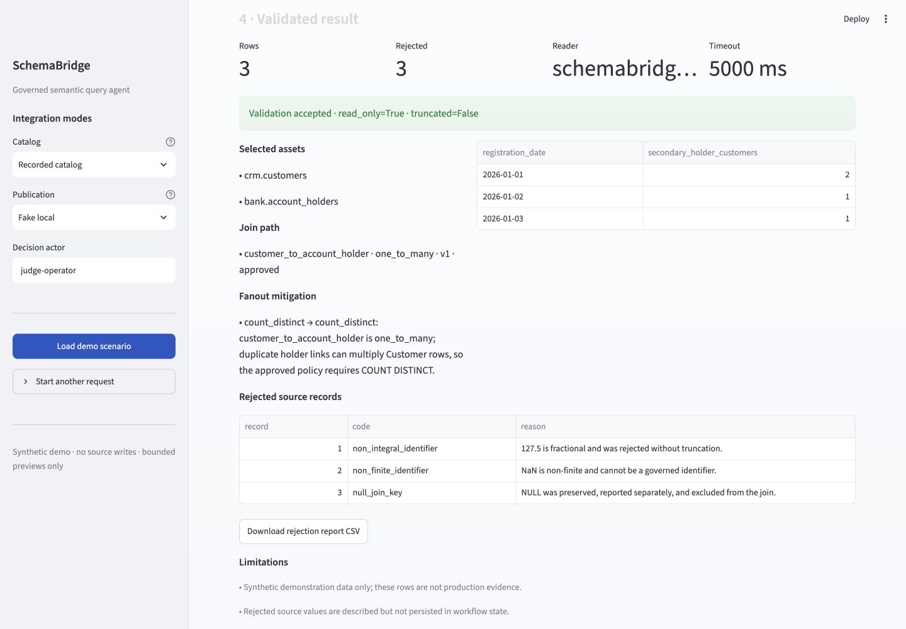

# SchemaBridge

**Turn inconsistent physical schemas into approved semantic context before generating SQL.**

SchemaBridge is a DataHub-native governed semantic query agent. It proposes explainable column
mappings and join contracts, asks a human to approve semantic decisions, compiles a typed analytical
request into deterministic PostgreSQL, independently validates the final SQL AST, and can return a
standalone query to copy into another PostgreSQL client. A bounded read-only preview is optional;
approved semantic context can be written back to DataHub through its separate approval path.

> Release status (2026-08-03): the public repository and Apache-2.0 license are verified. The
> recorded judge image passes local build/smoke tests, but no public demo URL, public video, clean
> release commit, tag, operated production cluster, or production SLO is claimed. The generated
> M18 manifest remains development evidence until those operator steps are complete. M20–M29 are
> accepted locally within their stated synthetic/local scopes; the corrective hosted M29 rerun and
> every external production/release gate remain open. M32—the bounded simple/advanced
> natural-language to copyable PostgreSQL capability described below—is accepted locally for its
> deterministic/synthetic scope. M33 is accepted locally for tenant-bound server-derived semantic
> onboarding through an immutable `ready_for_publication` handoff. M34 is accepted locally for
> queued, approval-gated publication of an exact registry-v2 document, independent DataHub
> read-back, and a separate activation-ready handoff; the publisher cannot activate a registry.
> M35 is accepted locally for one approved same-connection join or one complete model
> replacement/remediation over an exact active registry-v2, including PostgreSQL v15 authority,
> HTTP, publication witness and activation-ready handoff. It still performs no automatic
> activation and the local DataHub read-back evidence is simulated.
> Live-provider evaluation, independent security verification, an operated pilot, and every
> production/release control remain open. No error-free, all-SQL-dialects, or production claim is
> made. The exact support matrix and adoption gates are in the
> [commercial usage plan](docs/19_COMMERCIAL_USAGE.md); the tenant lifecycle, RACI, daily use,
> incident and offboarding procedures are in the
> [objective commercial operating model — NO-GO draft](docs/commercial/README.md).

## The result in 90 seconds

The north-star request is:

> Count customers by registration date when they are a secondary holder of an account.

The source uses customer keys such as `"00000000123"`, `123`, and `123.0`, and role values such as
`SECONDARY`, `2`, and `CO_HOLDER`. A naive join can both truncate invalid floats and overcount a
customer who has more than one holder link. SchemaBridge selects the approved
`Customer → AccountHolder` one-to-many contract, applies `COUNT DISTINCT` only to the contract's
approved Customer key, and returns:

| Registration date | Distinct customers |
|---|---:|
| 2026-01-01 | 2 |
| 2026-01-02 | 1 |
| 2026-01-03 | 1 |

It separately reports `127.5` (`non_integral_identifier`), `NaN`
(`non_finite_identifier`), and `NULL` (`null_join_key`) instead of repairing or hiding them.



Inspect the generated [request](examples/final/analytical-request-secondary-holders.yml),
[resolved plan](examples/final/resolved-query-plan-secondary-holders.yml),
[SQL](examples/final/generated-secondary-holders.sql),
[validation report](examples/final/query-validation-report.yml), and
[rejection report](examples/final/rejected-records.csv) without running the project.

## Prepared judge quick test

This is the exact clean-checkout command to run after the release commit is pushed; it is not yet a
verified remote-release instruction. The secret-free Docker path uses recorded synthetic catalog
and result evidence, a deterministic typed intent parser, the real planner/compiler/SQL guard, and
fake local publication. Every mode is visible in the UI; it never presents the recording as live
DataHub, PostgreSQL, or LLM output.

```bash
git clone https://github.com/Crespillo95/schemabridge-codex-starter.git
cd schemabridge-codex-starter
make judge-build
docker run -d --name schemabridge-judge \
  -p 127.0.0.1:7860:7860 schemabridge-judge:local
make judge-smoke
```

Open `http://localhost:7860`, select **Load demo scenario**, confirm the distinct-customer
interpretation, and approve the bounded preview. **Reset demo** starts fresh local workflow state;
it does not mutate a source database or DataHub.

The public judge URL is intentionally absent until the exact release commit is deployed and tested
from incognito plus a second network. Build, cold-start, rollback, and status procedures are in
[M17 judge operations](docs/17_JUDGE_OPERATIONS.md).

## Why DataHub is essential

SchemaBridge does not replace DataHub or its Analytics Agent. DataHub's Analytics Agent already
answers plain-English questions with SQL, results, and charts grounded in catalog context.
SchemaBridge addresses an earlier governance problem: what happens when the catalog does not yet
contain an approved equivalence between inconsistent keys, normalization rules, and safe join
cardinality?

| Stage | DataHub + SchemaBridge behavior |
|---|---|
| Read | MCP searches the catalog and retrieves bounded schemas, descriptions, governance, lineage, and query-context states. Missing evidence stays visible. |
| Act | SchemaBridge ranks mapping/join proposals with evidence, confidence, risks, and explicit human review; confidence never grants approval. |
| Write | A scoped, approval-gated adapter publishes logical-model context, glossary terms, decision documents, join contracts, and SQL-free query recipes. Every target has an audit result. |
| Reuse | A new workflow retrieves the approved recipe and provenance, then replans, recompiles, reparses, and asks for execution approval again. Saved SQL is never executed. |

The checked-in [write-back artifact](examples/final/datahub-writeback.yml) exercises the exact
approval/audit contract with a clearly labeled fake and names the live integration command. The
full local path performs and reads back the writes against synthetic DataHub Core; artifact
generation itself never changes DataHub.

## Architecture and safety

```text
Streamlit / CLI / authenticated API / worker
      │ typed commands and view models
      ▼
Application use cases ───── ports ───── DataHub / PostgreSQL / LLM / storage adapters
      │
      ▼
Pure domain: mappings · approvals · joins · requests · plans · validation
```

The LLM can return only a validated typed intent; it cannot return executable SQL, physical assets,
tools, or approvals. A deterministic compiler produces PostgreSQL from a restricted query plan, and
an independent SQLGlot guard reparses the final statement. The preview adapter separately enforces
the `schemabridge_reader` identity, a read-only transaction, a 5-second timeout, a row cap, an asset
allowlist, and a maximum of three tables/two joins. Source databases are never written.

DataHub writes require an exact human approval bound to the reviewed fingerprint. The MCP identity
is read-only; a separate scoped writer is used only for synthetic demo assets. Secrets remain in
ignored local files and are never required by the hosted recorded mode.

M21 replaces the three split planning fixtures in active composition with one atomic, scoped
semantic registry: `synthetic_enterprise` version 1 contains 7 logical models, 31 approved physical
mappings, and 5 approved join contracts. Every field carries a definition, canonical type, role,
status, and version. The registry can grow independently of the unchanged per-query 3-table/2-join
limit; a fourth table or third join still fails closed. Its checked-in synthetic bundle fingerprint
is `0710148874049078f751ac96f0a18131cf01daa41f27dc034ca52a8b212dd966`.

M22 can publish that approved bundle as one workspace-hashed immutable DataHub document and read it
back through the same registry port with no manifest fallback. The current local-demo live version
contains 7 models/31 mappings/5 joins/37 decisions/7 related assets and has fingerprint
`ef480eb7370924ff4c94131a2c6c4063d85652cc83aaec9059538cdc2cf9c1b9`. That M22 v1 document remains
historical read-only evidence; M23 requires a strict v2-or-later document for first activation.

The current demo corpus contains 465 deterministic synthetic rows across 11 tables and 8 schemas.
It includes commerce, fulfillment, and deliberately ungoverned support homonyms in addition to the
original Customer/Account domain. A seed manifest verifies exact row, schema, constraint, data, and
permission hashes; `make demo-reset-proof` reproduces global fingerprint
`487388495115265d5fac5a17675e05c236fd4eb4c430613ef02050a5f6010654` across two clean resets.

See [architecture](docs/02_ARCHITECTURE.md), [security](docs/06_SECURITY.md), and the
[query pipeline](docs/05_QUERY_PIPELINE.md).

## Full local DataHub path

Prerequisites: Docker Desktop with Compose v2, GNU Make, and Python 3.11–3.13. The complete path
starts pinned PostgreSQL 16.13 and DataHub Core v1.6.0, ingests only synthetic assets, provisions
scoped identities, and runs the live integration/acceptance suites:

```bash
bash scripts/bootstrap.sh
make demo-reset
make datahub-start
make datahub-init-admin
make datahub-ingest
make datahub-provision-mcp
make datahub-provision-writer
make datahub-catalog-check
make datahub-mcp-check
.venv/bin/schemabridge registry-prepare --json
# Review the target/fingerprint, then run registry-publish with explicit actor/fingerprint/confirm.
make datahub-registry-check
make check
make test-integration
make test-acceptance
make ui
```

Provisioning writes ignored mode-0600 local credentials. Follow the exact reset, verification,
troubleshooting, and cleanup sequence in the [runbook](docs/12_RUNBOOK.md); do not infer that a
partial command list proves the full integration.

## M23 durable control-plane operator path

M23 adds an explicitly migrated PostgreSQL control plane for the active semantic-registry pointer,
immutable transition history, projection outbox, HMAC-chained audit, managed workflow state,
legacy quarantine, identity bindings, and backup/restore. It is an operator surface, not a web
startup side effect: application replicas check the schema but never migrate, reconcile, restore,
or rotate identity state.

Configure `SCHEMABRIDGE_CONTROL_PLANE_MODE=postgres`,
`SCHEMABRIDGE_REGISTRY_MODE=live`, and
`SCHEMABRIDGE_SEMANTIC_REGISTRY_SELECTION=active`. Inject the runtime, reconciler, migrator, and
fresh restore credentials through their separate secret-manager variables:
`SCHEMABRIDGE_CONTROL_DATABASE_URL`, `SCHEMABRIDGE_CONTROL_RECONCILER_DATABASE_URL`,
`SCHEMABRIDGE_CONTROL_MIGRATOR_DATABASE_URL`, and
`SCHEMABRIDGE_CONTROL_RESTORE_DATABASE_URL`. The source `DATABASE_URL`, active control database,
and restore target must identify different PostgreSQL databases; `control-plane check` verifies
the separation from server-observed facts. Never place DSNs, HMAC/identity keys, OIDC material, or
DataHub tokens in argv, shell history, examples, logs, or Git. Managed web processes receive only
the runtime control credential; elevated credentials belong to short-lived operator jobs.

For the dedicated local synthetic control service:

```bash
make control-plane-up
make control-plane-migrate
make control-plane-check
```

`make control-plane-reset` destroys only that local synthetic control volume and is never a
production migration or restore procedure. The equivalent deployment commands are
`schemabridge control-plane migrate --json` and `schemabridge control-plane check --json`; migrate
uses the migrator role, while check opens all three control roles read-only.

Publish, activate, inspect, reconcile, and—if necessary—roll back one exact immutable registry
version. Every prepare/inspect command must be reviewed; pass only its freshly returned
fingerprint and timestamp to the paired mutation:

```bash
.venv/bin/schemabridge control-plane registry prepare-version \
  --workspace-id "$M23_WORKSPACE_ID" --target-version 2 --json
.venv/bin/schemabridge control-plane registry publish-version \
  --workspace-id "$M23_WORKSPACE_ID" --target-version 2 \
  --fingerprint "$M23_VERSION_FINGERPRINT" \
  --confirm publish-approved-registry-version --json

.venv/bin/schemabridge control-plane registry prepare-activation \
  --workspace-id "$M23_WORKSPACE_ID" --target-version 2 --json
.venv/bin/schemabridge control-plane registry activate \
  --workspace-id "$M23_WORKSPACE_ID" --target-version 2 \
  --proposal-fingerprint "$M23_ACTIVATION_FINGERPRINT" \
  --confirm activate-approved-registry-version --json
.venv/bin/schemabridge control-plane status \
  --workspace-id "$M23_WORKSPACE_ID" --json

.venv/bin/schemabridge control-plane reconcile inspect \
  --workspace-id "$M23_WORKSPACE_ID" --json
.venv/bin/schemabridge control-plane reconcile repair \
  --workspace-id "$M23_WORKSPACE_ID" \
  --report-fingerprint "$M23_RECONCILIATION_FINGERPRINT" \
  --inspected-at "$M23_RECONCILIATION_INSPECTED_AT" \
  --confirm repair-active-registry-projection --json

.venv/bin/schemabridge control-plane registry prepare-rollback \
  --workspace-id "$M23_WORKSPACE_ID" \
  --transition-id "$M23_ROLLBACK_TRANSITION_ID" --json
.venv/bin/schemabridge control-plane registry rollback \
  --workspace-id "$M23_WORKSPACE_ID" \
  --transition-id "$M23_ROLLBACK_TRANSITION_ID" \
  --proposal-fingerprint "$M23_ROLLBACK_FINGERPRINT" \
  --confirm rollback-to-approved-registry-version --json
```

PostgreSQL is the planning authority. Activation and rollback create monotonically increasing
generations and a pending projection outbox; DataHub projection repair is separately approved.
`status`, registry preparation, and reconciliation inspection perform no mutation. Ahead,
conflicting, corrupt, superseded, or audit-gap reconciliation findings are stop conditions, not
permission to overwrite DataHub. Retain each successful activation/rollback `transition_id`; a
future rollback target must be one of those previously active strict transitions.

Legacy import is offline and dry-run-first. Keep the SQLite file unchanged and free of active
WAL/SHM/journal writers:

```bash
.venv/bin/schemabridge control-plane legacy-import inspect \
  --source "$M23_LEGACY_SQLITE_PATH" --json
.venv/bin/schemabridge control-plane legacy-import apply \
  --source "$M23_LEGACY_SQLITE_PATH" \
  --plan-fingerprint "$M23_LEGACY_PLAN_FINGERPRINT" \
  --confirm import-validated-legacy-control-state --json
```

`inspect` writes only a metadata dry-run reservation and no imported target row. `apply` reinspects
the exact source, minimizes accepted workflow state, and quarantines orphan, ambiguous, invalid,
fake, or identity-mismatched resources instead of inferring ownership.

Identity initialization and rotation accept only a short-lived, owner-only signed evidence
envelope produced by a trusted OIDC verification boundary. Review its bounded metadata, initialize
the old lineage once, then prepare, reserve, and atomically complete the exact all-owner plan:

```bash
.venv/bin/schemabridge control-plane identity inspect-evidence \
  --evidence-file "$M23_IDENTITY_EVIDENCE_FILE" --json
.venv/bin/schemabridge control-plane identity initialize \
  --evidence-file "$M23_IDENTITY_EVIDENCE_FILE" \
  --evidence-fingerprint "$M23_IDENTITY_EVIDENCE_FINGERPRINT" \
  --approved-at "$M23_IDENTITY_INITIALIZED_AT" \
  --confirm initialize-verified-oidc-bindings --json
.venv/bin/schemabridge control-plane identity prepare \
  --evidence-file "$M23_IDENTITY_EVIDENCE_FILE" \
  --evidence-fingerprint "$M23_IDENTITY_EVIDENCE_FINGERPRINT" --json
.venv/bin/schemabridge control-plane identity approve \
  --evidence-file "$M23_IDENTITY_EVIDENCE_FILE" \
  --evidence-fingerprint "$M23_IDENTITY_EVIDENCE_FINGERPRINT" \
  --plan-fingerprint "$M23_IDENTITY_PLAN_FINGERPRINT" \
  --approved-at "$M23_IDENTITY_APPROVED_AT" \
  --confirm rotate-verified-oidc-bindings --json
.venv/bin/schemabridge control-plane identity complete \
  --evidence-file "$M23_IDENTITY_EVIDENCE_FILE" \
  --evidence-fingerprint "$M23_IDENTITY_EVIDENCE_FINGERPRINT" \
  --plan-fingerprint "$M23_IDENTITY_PLAN_FINGERPRINT" \
  --approval-id "$M23_IDENTITY_APPROVAL_ID" \
  --completed-at "$M23_IDENTITY_COMPLETED_AT" --json
```

The envelope never belongs in the web runtime or repository. Rotation preserves historical
actors, grants, decisions, and payload bytes; it changes only verified opaque authorization
bindings.

A stale recipe is replaced only from a completed workflow planned, independently guarded, and
read-only executed against the current active registry. Preparation emits no SQL or preview rows:

```bash
.venv/bin/schemabridge control-plane recipe-migration prepare \
  --workspace-id "$M23_WORKSPACE_ID" \
  --workflow-id "$M23_REPLACEMENT_WORKFLOW_ID" \
  --intent-fingerprint "$M23_RECIPE_INTENT_FINGERPRINT" \
  --owner-actor-id "$M23_WORKFLOW_OWNER_ACTOR_ID" \
  --adapter live --json
.venv/bin/schemabridge control-plane recipe-migration publish \
  --workspace-id "$M23_WORKSPACE_ID" \
  --workflow-id "$M23_REPLACEMENT_WORKFLOW_ID" \
  --intent-fingerprint "$M23_RECIPE_INTENT_FINGERPRINT" \
  --owner-actor-id "$M23_WORKFLOW_OWNER_ACTOR_ID" \
  --proposal-fingerprint "$M23_RECIPE_MIGRATION_FINGERPRINT" \
  --confirm 'PUBLISH VALIDATED QUERY RECIPE' \
  --adapter live --json
```

Publication creates a new SQL-free recipe version; it never edits or executes the historical
recipe. `--adapter fake` is local-only and is rejected in managed profiles.

Finally, create owner-only signed backup artifacts and restore only into a distinct empty target:

```bash
umask 077
.venv/bin/schemabridge control-plane backup \
  --destination "$M23_BACKUP_DIRECTORY" --json
.venv/bin/schemabridge control-plane restore \
  --archive "$M23_BACKUP_ARCHIVE" \
  --manifest "$M23_BACKUP_MANIFEST" --json
```

There is intentionally no target-DSN flag; restore reads
`SCHEMABRIDGE_CONTROL_RESTORE_DATABASE_URL` only from secret configuration. Cut over only after
schema checksum, complete state digest/table counts, every audit chain, active pointer/history,
pending outbox, identity bindings, and quarantine counts verify exactly. These operator workflows
never write a source database. The detailed stop conditions, replay behavior, and failure drills
are in the [M23 runbook](docs/12_RUNBOOK.md).

## M24 authenticated API and durable worker

M24 adds one closed asynchronous action: enqueue the exact preview of a workflow already paused at
human execution approval. It does not accept SQL, a natural-language request, a physical asset, or
an arbitrary task. Actor/workspace come from a verified bearer; revision, plan fingerprint, exact
confirmation, and idempotency identity are rechecked before one atomic PostgreSQL reservation.

The API and worker start separately:

```bash
make control-plane-reset       # local synthetic control database only
make control-plane-migrate
make control-plane-check
make api
# separate terminal:
make worker
```

The API exposes bounded liveness/readiness and submit/inspect/cancel endpoints under `/v1`. The
worker claims through database-time leases plus monotonic fencing, reloads the exact grant,
workflow, and active registry, recompiles the typed plan, reruns the independent SQL guard, and
uses the existing read-only source adapter. Delivery is at least once; retries are finite, stale
workers are fenced, cancellation is cooperative after claim, and ambiguous external reads require
human retry instead of blind replay.

PostgreSQL job migration `0002_authenticated_api_jobs.sql` has SHA-256
`4e828aacfc9cc0db35a5b05838556e35360d7e0322c16e1ed008c94faf4f4efc`. Durable/API output contains
only job lifecycle and a bounded count/fingerprint/rejection summary—never bearer tokens, claims,
raw idempotency keys, lease capabilities, SQL, parameters, prompts, source values, or preview
rows. `schemabridge_api` and `schemabridge_worker` are distinct least-privilege roles.

M24 does not call an LLM and neither process needs `OPENAI_API_KEY`. M27's optional, separately
configured Query Studio runtime is the only current description-matching process that may read the
existing environment key. The final `make check` passes 1,074 tests
with 99 deselected and strict mypy over 180 source files. The final service gates pass 84
integration tests and 19 acceptance tests; the API and worker subsets pass 16 and 21 tests.
Deterministic evaluation passes over 11 tables/465 rows with the live LLM explicitly `not_run`,
and the full coverage run passes 1,173 tests at 81.62%. Wheel migration smoke, the non-root
runtime image, schema-v3 worker probe, role separation, real process crash/reclaim, and
internal-browser desktop/390x844 acceptance also pass. Migration
`0003_reject_expired_job_success.sql` has SHA-256
`fba8bf2fec35c56be95487c21452ac46a45b3598c5b56cf382414aa57c7240f0`.
See the [runbook](docs/12_RUNBOOK.md), [browser record](docs/14_BROWSER_ACCEPTANCE.md), and
[M24 handoff](tasks/M24_HANDOFF.md). These are local milestone results, not a public release or
production-deployment claim.

Catalog size is a different axis from query size. M25 now dynamically loads each tenant's
connection/table/field inventory through atomic PostgreSQL generations and signed keyset pages.
Per-workspace connection, asset, field, request, job, and generation-retention limits are
versioned operator-managed data, not a fixed product table count. The operated local report covers
10 assets/75 fields and 5,434 assets/41,028 fields across two large-tenant connections. Sparse
64-field assets add nested paths, Unicode names, and type/definition/nullability variety. The
29.685331-second large refresh stayed within the local budget; 5,000 concurrency-16 reads had zero
unexpected errors at p95/p99 41.762/54.951 ms, and asset/field probes used their expected indexes
under the default PostgreSQL planner. Tags and glossary terms are searchable candidate evidence.
These are local regression budgets, not production SLOs; M25's final full gate and browser
evidence passed and are recorded in its handoff. The unchanged governed query limit remains three
physical tables/two joins.

## M27 dynamic Query Studio — accepted locally on synthetic data

Query Studio now derives guided controls and short-description matching from current governed
context instead of a fixed Customer/AccountHolder selector. It displays actual server-observed
connection, physical-asset, physical-field, and governed-mapping counts, so 10-table and
5,434-table tenants use the same bounded keyset path. Physical discovery is visibly separate and
always `needs_mapping_review`; only current approved/revalidated governed bindings can become
executable candidates.

A slight Spanish or English field description expands locally into bounded search probes, a
deterministic shortlist, and a server-owned typed proposal. If the optional provider is enabled,
it may select only server-numbered option `1` for a strict compatible leader; SchemaBridge derives
the source span, scoped candidate, governed filter value, roles, operations, joins, ordering, and
limit. A top-score tie stays ambiguous before provider interpretation. The prompt closure is
capped at three models, twelve fields, and two approved joins. A unique field match is evidence,
not a standalone approval: it becomes executable only inside a complete typed request that
receives a signed preview and exact human confirmation. Editing an interpretation invalidates its
signature; the server recomputes current evidence and re-signs before the existing M26 gate,
deterministic compiler, independent AST guard, and bounded read-only preview.

Optional external AI is tenant opt-in and defaults off. Schema v6 introduced the
inspect/prepare/apply policy flow; additive schema v7 rejects a successful usage settlement unless
both observed token counts are positive and within the reserved estimates, while failures remain
conservatively charged to their reservation. The migration aborts on incompatible history instead
of repairing it. Schema v8 additionally validates deterministic audit derivations, refreshes lease
time after row-lock waits, serializes admission state before daily usage, and reasserts exact
runtime-only function ACLs. Sanitized audit rows contain no prompts, responses, source values, SQL,
or raw identity. The evaluation policy tests `gpt-5-nano-2025-08-07` before 5.4-nano and Luna and
never cascades models at runtime.

The final boundary pins prompt `m27-openai-prompts-v16`, strict output schema
`m27-query-studio-v10`, matcher `m27-deterministic-v9`, expansion contract
`m27-expansion-contract-v10`, selection contract `m27-slot-selection-v4`, proposal normalizer
`m27-proposal-defaults-v3`, and campaign plan `m27-cheapest-first-campaign-v11`. The provider-free
`m27-deterministic-v8` retrieval report remains a PASS: top-1 `56/62` (`90.32%`),
top-3/recall@20 `62/62`, MRR `0.946237`, no-match `31/31`, ambiguity `6/6`, zero provider calls,
and zero ungoverned executable results over the 5,434-decoy regression.

The signed v11 live campaign evaluated the complete 136-case synthetic corpus and selected
`gpt-5-nano-2025-08-07`, the first and cheapest candidate, with no runtime cascade. It passed
`62/62` positive recall@20, all 31 negative outcomes, `18/18` ambiguity trials, `15/15` typed core
trials, and `10/10` adversarial cases; top-1 was `56/62`, top-3 was `62/62`, and MRR was
`0.946237`. Qualification plus the retained full run used 16 provider attempts, 15,715 input
tokens, 1,204 output/reasoning tokens, 30,016 ms, and EUR 0.001394085. The signed whole-file
SHA-256 is `beef3391aef2ea2cedfdfbc6e065ce259f7143861ccc0470197c6edcb88ba30a`.

The accepted v2 attestation binds that immutable campaign to exactly 16 settled interpretation
reservations/audits and exact token totals through one authenticated unique ordinal correlation.
It deliberately does not claim a native content-derived case-to-request identity, because the
historical campaign did not persist a shared request nonce/fingerprint. Fake-mode internal-browser
acceptance covered the 10/75 and 5,434/41,028 profiles, short-description matching, typed
north-star proposal, deterministic SQL/AST/read-only preview, ambiguity, no-match, stale,
rate/quota/provider-down, `needs_mapping_review`, desktop/mobile layout, clean console, and
protected-data scans. The separate live-UI smoke was blocked by the browser URL policy before
submission; it made no provider call. Policy v86 leaves external AI disabled.

M27 is therefore accepted locally for the synthetic milestone, with that live-browser limitation
preserved and no production claim. See the
[deterministic M27 report](reports/m27-query-studio-deterministic-evaluation.md) and
[M27 handoff](tasks/M27_HANDOFF.md).

## M32 copy-first SQL for simple and advanced requests — locally accepted bounded scope

M32 targets the product behavior analysts asked for: describe a query in natural language, inspect
the exact interpretation, confirm it, then copy one complete PostgreSQL statement into another
PostgreSQL client connected to the same governed database/context. SchemaBridge execution is
optional and disabled by default for this flow.

The system does not claim to be infallible or accept every arbitrary SQL program. “Exact” means
that all requested semantics fit a closed typed contract, resolve through current approved table/
field/join context, and compile deterministically. If a field meaning, join, tie policy, or window
frame is ambiguous—or if the request needs an unsupported construct—SchemaBridge returns that
problem and generates no SQL.

Retrieval traverses every active approved logical model and field. Lexical scoring uses names,
definitions, and governed values, with role compatibility as a bonus after a lexical hit; canonical
types, roles, and value constraints are exposed and validated in the bounded closure rather than
used as free-text search tokens. Deterministic server code then reconstructs the relevant closure
and resolves/revalidates its current approved physical mappings, transformations, join contracts,
cardinality, fanout policy, and freshness bindings. Each request receives at most three models,
twelve fields, and two joins. M32 never promotes catalog-only fields: the separate M27
physical-discovery lane keeps them `needs_mapping_review`; similar names never become executable
automatically.

The flow has two operations:

1. **Prepare natural-SQL preview** — returns the typed interpretation, selected context, v1/v2
   route, resolved datasets/mapping/join reviews, assumptions, risks, and fingerprints. It resolves
   semantics for the preview but never compiles or exposes SQL.
2. **Confirm preview / generate copy artifact** — reloads current context, revalidates and
   re-resolves the signed request, compiles deterministically, guards the parameterized AST,
   renders typed literals, and guards the standalone SQL again. It never executes and returns
   `executed=false`.

For a human CLI review, `sql-from-natural --review-and-confirm` prepares once, prints the complete
preview, and confirms that same in-memory object/token. The older two-invocation fingerprint mode
re-prepares and deliberately fails closed if a live interpretation changes.

Version selection is semantic. Existing simple aggregate/filter requests remain on byte-stable v1
when completely representable. Row mode, fieldless row count, boolean trees, conditional metrics,
buckets, `HAVING`, windows, output filters/order, or advanced grouping use the separate v2
contracts. A long simple request remains v1; a short “rank products by revenue” request is v2.
Length, keywords, language, and model confidence never select a compiler lane.

The bounded advanced language covers:

- `ROW_NUMBER`, `RANK`, `DENSE_RANK`, `NTILE`, and top-N per group;
- partition averages and percentages of group totals;
- duplicate/group-threshold queries with `COUNT_ROWS`, `COUNT DISTINCT`, and `HAVING`;
- running/moving sums and averages;
- `LAG`, `LEAD`, delta, and percentage change;
- conditional aggregates and numeric buckets.

One request may expose at most four derived window outputs and eight window AST nodes.
Cross/self joins, arbitrary subqueries, set operations, recursion, and gaps/islands remain explicit
unsupported outcomes. `ROLLUP` is also excluded until a reviewed design emits `GROUPING()` flags
that distinguish subtotal `NULL` from genuine data `NULL`. PostgreSQL is the sole output dialect;
SQLGlot transpilation is not presented as MySQL, SQL Server, BigQuery, or Snowflake support.
The output is intended for the same governed PostgreSQL database/context shown in the preview,
not an unrelated database that happens to have homonymous schemas. Current approved physical
identifiers are unquoted-canonical lowercase ASCII names within PostgreSQL's 63-byte limit.

This capability matrix is benchmarked against the families in
[25 Ejemplos de Consultas SQL Avanzadas](https://learnsql.es/blog/25-ejemplos-de-consultas-sql-avanzadas/).
The article is a taxonomy reference, not copied SQL and not permission to bypass SchemaBridge's
typed language.

The advanced acceptance request groups completed orders by month and product category, calculates
net revenue, units, and distinct orders, applies a four-order `HAVING` threshold, ranks eligible
categories with an alphabetical tie-break, calculates percentage and cumulative revenue, and
keeps the top three per month. Its reviewed expected output is five synthetic rows. The complete
contract and ground truth are in
[M32 advanced copyable SQL plan](plans/M32_ADVANCED_COPYABLE_SQL.md).

M32 is accepted locally for this bounded deterministic/synthetic capability: `304/304` targeted
checks pass; the advanced standalone SQL SHA-256 is
`ec589a1527d0d641f4f7f7eb7e052ca1ace5b092013b437da72542ce4145d4f3`; and the global quality
gate passes `3,587` tests with `224` explicit deselections. The original 2026-07-30 in-app browser
attempt was unavailable. A later 2026-08-03 session passed exactly one advanced Spanish desktop
happy path; the remaining simple, v1/v2, blocked-state, hostile-input and 390×844 M32 browser
matrix is still pending, so no complete desktop/mobile/browser PASS is claimed. See the
[M32 deterministic evaluation](reports/m32-copyable-sql-deterministic-evaluation.md) and
[canonical browser record](docs/14_BROWSER_ACCEPTANCE.md).

## Measured synthetic evidence

`make evaluate` resets PostgreSQL and reproduces the complete case-level report. The current
development run reports:

- candidate precision/recall/F1: `3/4 = 0.750` each, with one retained false positive and one
  retained false negative;
- join path accuracy: `5/5 = 1.000`; cardinality accuracy: `2/2 = 1.000`;
- baseline typed intent equivalence: `1/1 = 1.000`; its four registry-wide language cases remain
  historical skips in this report and are evaluated separately by the M27 Query Studio corpus;
- result correctness and source-rejection correctness: `5/5 = 1.000` each;
- SQL safety rejection rate: `38/38 = 1.000`; malicious fixtures are guard-only and never executed;
- recipe reuse decisions: `2/2 = 1.000`;
- M15 live LLM evaluation: not run and never mixed with deterministic evidence.

These are small, tuned synthetic fixtures with raw counts, no confidence interval, and no production
quality or scalability claim. See the generated [evaluation summary](examples/final/evaluation-summary.md)
and full [evaluation report](examples/evaluation-report.md). M27 matching metrics remain separate
in `reports/m27-query-studio-deterministic-evaluation.md` and must not be mixed with superseded
campaign history or the signed v11 provider result.

## Integration modes and limitations

| Boundary | Secret-free judge image | Full local option |
|---|---|---|
| Catalog | recorded synthetic fixture | live DataHub MCP reads |
| Semantic registry | recorded immutable bundle | exact immutable DataHub version document |
| Intent | deterministic typed fake | optional structured-output model |
| Source | exact fingerprint-bound recorded observation | live read-only PostgreSQL |
| Publication | contract-compatible fake | approval-gated DataHub writer |

Limitations: PostgreSQL is the only executable/output dialect; copy SQL is intended for the same
governed PostgreSQL database/context shown in its preview; queries use at most three
tables/two joins and a restricted expression set; semantic mappings and DataHub mutations require
a human; the evaluation fixture is synthetic; M27's signed v11 result and browser evidence remain
local synthetic observations; the live-UI smoke was blocked before provider submission; and
DataHub plus the local SQLite audit ledger do not provide one distributed transaction. Brief
descriptions produce bounded ambiguity-aware governed matches, not arbitrary SQL or automatic
mapping approval. M32 does not guarantee every request is error-free and explicitly rejects
unsupported families instead of approximating them. This is a hackathon-derived system under
productionization, not production-ready enterprise infrastructure.

The productionization track includes accepted local M20–M29 boundaries. Managed browser deployments
require provider-neutral OIDC, explicit tenant allowlisting, preflighted HTTPS/auth secrets, closed
application roles, immutable server-side integration modes, diversity-checked versioned
HMAC-pseudonymous decision actors, atomically persisted workflow workspace/owner access, and a safe
recorded execution default. M21 adds the atomic multi-domain registry and deterministic corpus; M22
adds bounded immutable DataHub publication/read-back without recorded fallback; M23 adds the
separate migrated PostgreSQL authority and approval-gated operator workflows; M24 adds the
authenticated API/durable worker; and M25 adds dynamic tenant catalog indexing, capacity, pools,
and local scale measurement; M26 adds governed drift/change management; M27 adds bounded Query
Studio and optional tenant-governed AI; M28 adds connector routing/cost controls; and M29 adds
production-shaped local operations/supply-chain contracts. M32 is a separately accepted local
copy-first product capability; M33–M35 add governed onboarding, publication and immutable v2
changes. None advances the reserved M30/M31 production-evaluation, security-verification, pilot,
or GA gates. The public recorded judge profile remains intentionally anonymous and secret-free.

## Repository and evidence

- [Public repository](https://github.com/Crespillo95/schemabridge-codex-starter)
- [Generated example index](examples/README.md)
- [Browser acceptance and synthetic screenshots](docs/14_BROWSER_ACCEPTANCE.md)
- [M25 local scale report](reports/m25-scale-report.md)
- [M25 accepted local handoff](tasks/M25_HANDOFF.md)
- [M26 accepted local handoff](tasks/M26_HANDOFF.md)
- [M27 deterministic matching report](reports/m27-query-studio-deterministic-evaluation.md)
- [M27 local synthetic handoff and retained limitations](tasks/M27_HANDOFF.md)
- [M32 simple/advanced copyable PostgreSQL plan](plans/M32_ADVANCED_COPYABLE_SQL.md)
- [M32 architectural decision](docs/adr/0015-advanced-copyable-postgresql.md)
- [M35 registry-v2 change plan](plans/M35_REGISTRY_V2_CHANGE_LIFECYCLE.md)
- [M35 accepted local handoff](tasks/M35_HANDOFF.md)
- [Commercial support matrix and adoption plan](docs/19_COMMERCIAL_USAGE.md)
- [Objective commercial operating model and tenant lifecycle — NO-GO draft](docs/commercial/README.md)
- [M30 production evaluation/security plan](plans/M30_PRODUCTION_EVALUATION_SECURITY.md)
- [M31 controlled pilot/GA-readiness plan](plans/M31_CONTROLLED_PILOT_GA_READINESS.md)
- [Evaluation methodology](docs/15_EVALUATION.md)
- [Submission draft and link status](docs/18_DEVPOST_SUBMISSION.md)
- [Video script, caption, and rights checklist](docs/18_VIDEO_PRODUCTION.md)
- [Final sign-off checklist](docs/15_SUBMISSION_CHECKLIST.md)

Licensed under [Apache-2.0](LICENSE). AI assistance, dependencies, and asset provenance are disclosed
in [HACKATHON_DISCLOSURE.md](HACKATHON_DISCLOSURE.md).
