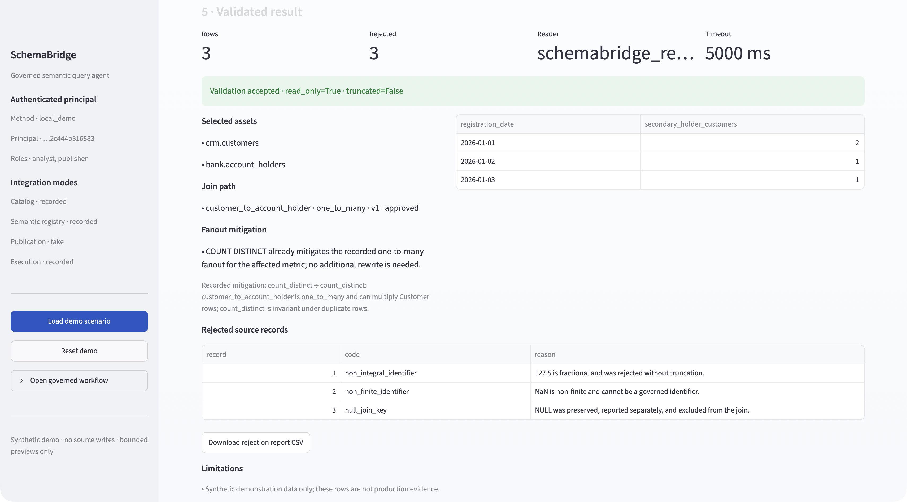
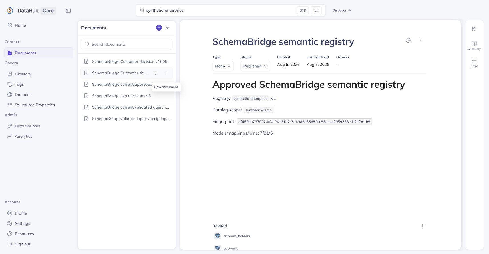

# SchemaBridge

**Govern meaning before SQL.**

SchemaBridge is a DataHub-native governed semantic query agent. It turns inconsistent physical
schemas into approved logical concepts and join contracts, then compiles business requests into
bounded PostgreSQL without letting an LLM emit executable SQL.

[Try the public judge demo](https://rcr-ia.eu/schemabridge/) ·
[Watch the narrated 2:55 demo](https://youtu.be/6Bw7yGhl24o) ·
[View the Devpost submission](https://devpost.com/software/schemabridge) ·
[Inspect the frozen release](https://github.com/Crespillo95/schemabridge-codex-starter/tree/devpost-m18-c5817af)

> Judge note: the public deployment needs no login, payment, or credentials. Its integration-mode
> panel labels every live, recorded, fake, and disabled boundary. The complete synthetic
> DataHub Core and read-only PostgreSQL path is proven by the narrated demo, frozen artifacts, and
> hosted CI; no recorded component is presented as live.

## The result in 90 seconds

The north-star request is:

> Count customers by registration date when they are a secondary holder of an account.

The same customer key is stored as `"00000000123"`, `123`, and `123.0`. The holder role appears as
`SECONDARY`, `2`, and `CO_HOLDER`. A valid-looking join can truncate unsafe floats or count the same
customer twice.

SchemaBridge selects the approved `Customer → AccountHolder` one-to-many contract, applies the
contract's exact `COUNT DISTINCT` mitigation, and produces:

| Registration date | Distinct customers |
|---|---:|
| 2026-01-01 | 2 |
| 2026-01-02 | 1 |
| 2026-01-03 | 1 |

It reports `127.5` (`non_integral_identifier`), `NaN` (`non_finite_identifier`), and `NULL`
(`null_join_key`) as visible rejections. It never repairs, truncates, or hides them.



## Five-minute judge path

1. Open the [public demo](https://rcr-ia.eu/schemabridge/) and select **Load demo scenario**.
2. Confirm that the request counts distinct customers, not holder relationships.
3. Review the approved mapping, one-to-many join, and exact fanout mitigation.
4. Approve the bounded preview and inspect the deterministic SQL plus independent AST evidence.
5. Verify `2 / 1 / 1`, the three rejected identifiers, and the SQL-free reusable recipe.

The [narrated demo](https://youtu.be/6Bw7yGhl24o) follows the same path in 2:55. Its voiceover is
AI-generated with OpenAI text-to-speech; the disclosure also appears in the video description.

### What the public deployment actually runs

| Boundary | Public mode | What is exercised |
|---|---|---|
| Planning, compilation, SQL AST policy | Live | Real typed planner, deterministic compiler, and independent final-statement guard |
| Catalog and semantic registry | Recorded | Bounded synthetic DataHub observations and an exact versioned registry bundle |
| Source result and rejection evidence | Recorded | Exact versioned PostgreSQL observation for the north-star request |
| Intent interpretation | Deterministic fake | API-key-free typed intent; no public LLM secret |
| Publication | Fake local | Approval/audit behavior without public DataHub writer credentials |

There is no silent fallback. The UI exposes these modes before a judge approves anything. The
separate integration proof uses live synthetic DataHub Core v1.6.0 and a live PostgreSQL 16.13
database with the dedicated `schemabridge_reader` role.

## Why DataHub is essential

SchemaBridge governs the semantic layer that a downstream analytics agent needs when physical
schemas disagree.

| Stage | DataHub + SchemaBridge behavior |
|---|---|
| Read | Search bounded assets and retrieve schemas, descriptions, governance, lineage, and query context. Missing evidence stays missing. |
| Decide | Rank mappings and joins with evidence, confidence, risks, and missing evidence. Confidence never grants approval. |
| Write | After exact human approval, publish logical-model context, decisions, join contracts, and SQL-free recipes with target-level audit results. |
| Reuse | Load approved context in a fresh workflow, then replan, recompile, revalidate, and request execution approval again. Saved SQL is never executed. |



## Safety by construction

```text
Streamlit / CLI / API / worker
             │ typed commands
             ▼
       Application use cases ─── ports ─── DataHub / PostgreSQL / LLM adapters
             │
             ▼
 Pure domain: mappings · approvals · joins · plans · validation
```

- The LLM may return only a validated typed intent—not SQL, physical assets, tools, or approvals.
- A deterministic compiler emits parameterized PostgreSQL from a restricted typed plan.
- An independent SQLGlot guard allows exactly one `SELECT` or `WITH … SELECT` over approved assets.
- Queries are capped at three tables, two joins, 500 rows, and a five-second timeout.
- Preview execution uses a non-superuser role with `default_transaction_read_only=on`.
- Cartesian joins, unknown assets, DDL, DML, utility statements, concealed statements, and unsafe
  identifiers fail closed.
- DataHub writes use a separate credential and require approval bound to the reviewed fingerprint.
- The repository and demonstrations contain synthetic data only.

Read the [architecture](docs/02_ARCHITECTURE.md), [security contract](docs/06_SECURITY.md), and
[query pipeline](docs/05_QUERY_PIPELINE.md) for the full design.

## Evidence, not claims

The frozen hackathon release is source commit
[`c5817af`](https://github.com/Crespillo95/schemabridge-codex-starter/commit/c5817af6d01b8a98cd7f1950d57e1be667614696)
under annotated tag `devpost-m18-c5817af`.

- 4,094 unit tests, 184 integration tests, and 66 acceptance tests pass in the strict clean-room run.
- 4,340 coverage tests pass at 81.32%.
- Hosted supply-chain, quality, PostgreSQL/DataHub integration, acceptance, and coverage jobs pass.
- Fresh PostgreSQL and DataHub bootstrap ingests 11 synthetic datasets and 121 metadata events.
- Approval-gated read-back proves 7 models, 31 mappings, 5 joins, and 37 decisions.
- DataHub restart persistence and fresh-workflow context reuse pass.
- YouTube reports the narrated public video has no copyright issues.

Inspect the generated artifacts without running anything:

- [Analytical request](examples/final/analytical-request-secondary-holders.yml)
- [Resolved query plan](examples/final/resolved-query-plan-secondary-holders.yml)
- [Generated PostgreSQL](examples/final/generated-secondary-holders.sql)
- [AST validation report](examples/final/query-validation-report.yml)
- [Rejected records](examples/final/rejected-records.csv)
- [DataHub write-back contract](examples/final/datahub-writeback.yml)
- [Release manifest and evidence bundle](examples/final/)

Reproduction, smoke, rollback, and failure procedures are in the
[judge operations runbook](docs/17_JUDGE_OPERATIONS.md). The
[submission checklist](docs/15_SUBMISSION_CHECKLIST.md),
[Devpost narrative](docs/18_DEVPOST_SUBMISSION.md), and
[screenshot inventory](docs/screenshots/m18/README.md) bind the public claims to evidence.

## Scope and honest limits

This is a PostgreSQL-first hackathon MVP evaluated on a tuned synthetic corpus. Per-query support is
limited to three tables, two joins, and a deliberately narrow expression set. The public judge
deployment is secret-free and therefore records its DataHub and source boundaries; the live
integration proof is separate. Production still requires protected release controls, independent
security and blind evaluation, operated IAM/observability evidence, and a pilot.

No claim is made that SchemaBridge is error-free, supports every SQL dialect, or is production
ready. See the [evaluation limits](docs/15_EVALUATION.md),
[commercial usage plan](docs/19_COMMERCIAL_USAGE.md), and
[NO-GO operating-model draft](docs/commercial/README.md).

## Repository map

| Path | Purpose |
|---|---|
| `src/schemabridge/domain/` | Pure typed policies and invariants; no I/O or frameworks |
| `src/schemabridge/application/` | Use cases and typed ports |
| `src/schemabridge/adapters/` | DataHub, PostgreSQL, SQL, LLM, and persistence adapters |
| `src/schemabridge/entrypoints/` | Streamlit, CLI, API, and worker translation layers |
| `demo/` | Deterministic synthetic schemas, seed data, and governed fixtures |
| `examples/final/` | Judge-readable generated artifacts |
| `docs/` | Architecture, security, evaluation, operations, and submission evidence |
| `plans/` and `tasks/` | Milestone contracts, decisions, state, and handoffs |

Licensed under [Apache 2.0](LICENSE).
