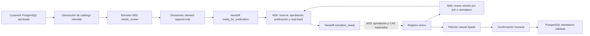

# Uso comercial y plan de adopción

## Veredicto actual

**NO-GO para producción, venta general o una promesa de SQL infalible.**

SchemaBridge tiene una base local amplia y M32 genera PostgreSQL determinista para copiar cuando
la petición cabe por completo en su lenguaje tipado y en contexto semántico aprobado. M33 cierra
localmente el onboarding genérico gobernado que evita editar fixtures para cada cliente, pero
termina en una propuesta inmutable `ready_for_publication`. M34 ya cierra localmente la cola
durable, aprobación posterior al ensamblado, publicación DataHub v2, read-back exacto y handoff
`activation_ready`; la activación sigue siendo un flujo M23 separado. M35 es el cierre local del
cambio posterior: alta de un join y reemplazo/remediación de un modelo contra una base v2 exacta,
siempre creando una versión nueva. La certificación M30, el piloto M31 y los controles externos
operados siguen siendo puertas de salida.

La decisión comercial defendible es **GO condicionado para una beta privada PostgreSQL
copy-first, aislada por cliente, sólo después de cerrar todos los P0 de M35/M30 y operación real**.
Sigue siendo **NO-GO hoy** y **NO-GO para GA multi-base/multi-dialecto**. Los planes ejecutables son
[M30](../plans/M30_PRODUCTION_EVALUATION_SECURITY.md) y
[M31](../plans/M31_CONTROLLED_PILOT_GA_READINESS.md).
El procedimiento de roles, despliegue, onboarding, uso diario, incidentes, retirada y scorecard
está separado en el
[modelo operativo comercial objetivo — borrador NO-GO](commercial/README.md); documentarlo no
prueba que esas operaciones hayan sido ejecutadas.

La promesa comercial correcta es **exactitud acotada y fallo cerrado**, no “experto supremo sin
errores”. Una consulta de 50 líneas puede ser compatible y otra de 5 líneas puede no serlo: manda
la semántica solicitada, el dialecto, las relaciones aprobadas y los límites, no el número de
líneas. Si falta contexto, hay ambigüedad o la familia SQL no está representada, el producto debe
devolver una explicación sin SQL.

## Qué capacidad local puede demostrarse hoy

| Área | Estado verificable | Límite de la afirmación |
|---|---|---|
| Inventario físico | Catálogo PostgreSQL multi-tenant, paginado y con capacidad durable por workspace | Inventariar miles de tablas no aumenta la capacidad de una consulta |
| Contexto semántico | Registro aprobado con modelos, campos, mapeos y contratos de join versionados | La similitud de nombres nunca equivale a aprobación |
| Lenguaje natural a SQL | Solicitudes simples y un conjunto avanzado tipado de agregaciones, filtros, buckets y ventanas | Sólo PostgreSQL y sólo cuando toda la intención es representable |
| Salida | SQL standalone validado para copiar o descargar | Managed liga `qsp3` y artefacto al target PostgreSQL exacto; local/recorded sin target es no comercial |
| Ejecución | Preview read-only separado, opcional y acotado cuando está habilitado | El flujo principal M32 no ejecuta: `executed=false` |
| Onboarding M33 | Preflight server-side, borrador tenant-bound, decisiones steward append-only y handoff inmutable | Cero escritura externa; no publicación ni activación |
| Publicación M34 | Reserva tenant-bound, worker aislado, aprobación del candidato completo, DataHub v2 y read-back exacto | No activa; la evidencia local/sintética no prueba IAM ni operación externa |
| Cambio M35 | Join nuevo y reemplazo/remediación de un modelo sobre una base v2 exacta, con dependencias y joins incidentes cerrados | No permite cambio masivo, cross-connection, borrado de modelo ni activación automática |
| Operación gestionada | Contratos locales de identidad, aislamiento, secretos, observabilidad, backup y supply chain | No equivalen a evidencia de proveedor/cluster/guardias operadas en producción |

### Matriz de bases, tablas y dialectos

“Multi-base” no significa lo mismo que “multi-dialecto” ni que “muchas tablas”. La promesa se
interpreta sólo mediante esta matriz:

| Escenario | Estado comercial | Condición/límite |
|---|---|---|
| Varios tenants, cada uno con PostgreSQL aislado | objetivo de beta, hoy NO-GO | onboarding, target binding, M30/M31 y operación independientes por tenant |
| Miles de tablas inventariadas en un tenant | catálogo paginado disponible localmente; escala comercial no certificada | no aumenta el máximo por consulta ni elimina cuotas/capacity tests |
| Una consulta sobre una conexión PostgreSQL | candidato acotado | máximo tres tablas y dos joins aprobados; `target_fingerprint` no nulo y confirmado antes de uso comercial |
| Join entre conexiones o PostgreSQL distintos | no soportado | no hay federación ni autoridad semántica compartida entre conexiones |
| Más de tres tablas o más de dos joins en una petición | no soportado | requiere contrato, fanout/coste, compilador/guard, corpus y release separados |
| MySQL, SQL Server, Oracle, BigQuery, Snowflake u otro motor | no soportado | cada dialecto requiere implementación y certificación propias; traducir sintaxis no basta |

### Relación con el benchmark LearnSQL solicitado

La referencia de nivel es
[“25 Ejemplos de Consultas SQL Avanzadas”](https://learnsql.es/blog/25-ejemplos-de-consultas-sql-avanzadas/),
no una promesa de reproducir literalmente sus 25 soluciones. M32 ya representa de forma tipada
ranking y top-N, `NTILE`, duplicados con `GROUP BY`/`HAVING`, cálculos de ventana, totales y medias
móviles, `LAG`/`LEAD`, deltas y porcentajes, agregaciones condicionales y buckets numéricos. Eso
cubre una parte material de las familias analíticas del artículo con compilación determinista.

M32 rechaza de forma explícita los ejemplos o variantes que requieren `CROSS JOIN`, self join,
subconsultas arbitrarias o correlacionadas, operaciones de conjuntos como `INTERSECT`, recursión,
gaps-and-islands y `ROLLUP`. Este último permanece fuera hasta que un contrato revisado exponga
flags `GROUPING()` capaces de distinguir un subtotal `NULL` de un `NULL` gobernado real. El criterio
de aceptación comercial será una matriz por familia y significado, no “genera 25 de 25” ni una
comparación por longitud del texto SQL.

| Grupo comparable del artículo | Estado verificable hoy | Puerta restante |
|---|---|---|
| Proyección, filtros, orden/límite | representado por el lenguaje tipado y aceptación automatizada | M30 con corpus ciego por significado |
| Agregados, `HAVING`, `CASE` condicional y buckets | representado y compilado determinísticamente | equivalencia/oracle M30 por familia y riesgo |
| Top-N, ranking y `NTILE` | representado por plan v2 | corpus holdout y target binding certificado |
| Ventanas móviles, running totals, `LAG`/`LEAD` y porcentajes | representado por plan v2; un happy path avanzado desktop observado | matriz manual completa y campaña M30 |
| `CROSS JOIN` y self join | no soportado | contrato semántico/fanout, compilador, guard y certificación futuros |
| Subconsultas arbitrarias/correlacionadas y `INTERSECT`/set operations | no soportado | álgebra tipada y certificación futuras |
| `ROLLUP`/`GROUPING` seguro | no soportado | política total que distinga subtotal `NULL` de dato `NULL` y nueva campaña |
| Recursión y gaps-and-islands | no soportado | roadmap separado con límites, coste, guard y oracle propios |

Esta tabla demuestra paridad parcial por familias, no cobertura literal **25/25**. Ningún grupo de
roadmap puede venderse como disponible por producir SQL parecido o por superar cierta longitud.

No están soportados como promesa comercial actual:

- MySQL, SQL Server, Oracle, BigQuery, Snowflake, Redshift u otros dialectos;
- pegar el SQL en una base homónima no gobernada y asumir equivalencia semántica;
- joins entre conexiones, federación, self joins o más de tres tablas por petición;
- SQL arbitrario, expresiones libres, subconsultas arbitrarias, operaciones de conjuntos,
  recursión, gaps-and-islands o `ROLLUP` sin flags de agrupación gobernados;
- autoaprobar modelos, campos, mapeos, joins o mutaciones de DataHub;
- modificar una base fuente, ocultar registros rechazados o reparar identificadores ambiguos;
- aprobar o compilar `string → date` mediante `parse_date`: PostgreSQL `TO_DATE` no ofrece por sí
  solo una validación total y exacta de shape/calendario, por lo que hoy se rechaza;
- garantizar resultados correctos si el catálogo, el significado de negocio o los contratos
  aprobados son incorrectos o están desactualizados.

## Capacidad y límites seguros

Estos son límites de producto, no una estimación de rendimiento para cualquier infraestructura.

| Superficie | Límite actual |
|---|---:|
| Tablas físicas por consulta | 3 |
| Joins aprobados por consulta | 2 |
| Conexiones por consulta | 1 |
| Modelos en el cierre de contexto de una petición | 3 |
| Campos en el cierre de contexto de una petición | 12 |
| Longitud máxima de la petición en lenguaje natural | 2.000 caracteres |
| Menciones semánticas por petición | 12 |
| Profundidad máxima de predicados | 4 niveles |
| Hojas máximas de predicados | 16 |
| Valores máximos en un predicado `IN` | 64 |
| Cálculos de ventana avanzados por petición | 4 |
| Preview | Deshabilitado por defecto; al habilitarlo, 500 filas por defecto y 10.000 máximo |
| Timeout de sentencia | 5.000 ms |
| Modelos por registro semántico | 100 |
| Campos por registro semántico | 1.000 |
| Mapeos por registro semántico | 2.000 |
| Contratos de join por registro semántico | 500 |
| Tablas base del control plane cubiertas por backup/restore | 88 actuales; máximo tipado 128 |
| Campos en un modelo de onboarding M33 | 100 |
| Propuestas de mapeo en un borrador M33 | 2.000 como límite estructural/storage; el alta HTTP efectiva es menor y depende del payload de 64 KiB |
| Evidencias o riesgos por propuesta M33 | 16 de cada tipo |
| Valores permitidos por campo M33 | 64 |
| Payload de borrador/propuesta M33 | 2 MiB |
| Payload de decisión M33 | 64 KiB |
| Historial M33 por inspección | 25 recientes por defecto; máximo 50 y `history_truncated` explícito |
| Target M34 | Una reserva durable por workspace/scope/registry/version |
| Intentos M34 | 5 por defecto; máximo tipado 10; backoff máximo 300 s |
| Lease M34 | 60 s por defecto; máximo 5 min; heartbeat 20 s por defecto |
| Autorización M34 | Sesión publisher y autorización menores de 15 min |
| Payload durable de un job M34 | 16 MiB; evento append-only 64 KiB |
| Padding de identificadores | 1–256 caracteres; valores mayores se rechazan antes de compilar |
| Regex de transformación | Subconjunto ASCII lineal, anclado con `^...$`; sin grupos, alternancia, lookaround, backreferences ni escapes de dialecto |

El inventario puede crecer independientemente hasta la capacidad durable que configure el
operador y se recorre mediante páginas y generaciones retenidas. Añadir 5.000 tablas significa
que pueden descubrirse y gobernarse sin redeploy; no significa que una consulta pueda unirlas.
Para ampliar las tres tablas o los dos joins hace falta un nuevo contrato, evaluación de fanout,
presupuesto de coste, pruebas de memoria/latencia y revisión de seguridad. No debe cambiarse sólo
una constante.

Los 2.000 mapeos de M33 son una cota del agregado y de almacenamiento, no la capacidad actual de
una sola llamada. El endpoint de creación hereda un cuerpo máximo de 64 KiB y M33 no ofrece edición,
chunking ni importación batch; por tanto el máximo transportable será menor y variará con el tamaño
de definiciones, evidencias y riesgos. Antes de prometer onboarding cercano a 2.000 mapeos hace
falta un flujo incremental o de importación por lotes, tenant-bound, reanudable, idempotente y con
CAS, sin relajar el límite de cuerpo ni la revisión humana.

El replay idempotente durable conserva un único borrador raíz y las decisiones append-only; no
duplica el borrador completo por decisión. La inspección pública sigue siendo una ventana reciente,
no una paginación histórica completa: un cursor de auditoría/exportación y cuotas operadas por
tenant continúan siendo requisitos previos a GA si el segmento necesita revisar cierres grandes.

El backup y la verificación de restore contabilizan las 88 tablas base actuales sin truncarlas. El
contrato rechaza un inventario superior a 128; ampliar ese límite exige una migración deliberada,
pruebas de memoria/tamaño del manifiesto y un restore completo antes de aceptar el nuevo esquema.
Los identificadores físicos aceptados son exactamente `schema.table.column`, con un único segmento
de `field_path`: nombres PostgreSQL canónicos lowercase sin comillas y de hasta 63 bytes por
segmento. Mixed-case/quoted identifiers y rutas anidadas de `struct`/`array` se rechazan en vez de
reinterpretarse o compilar sólo su último segmento.

Los formatos de fecha cerrados pueden deserializarse para leer contratos históricos, pero no
autorizan SQL: M33 rechaza cualquier mapeo `string → date`, el compilador devuelve
`unsafe_date_parse` y el guard no permite `TO_DATE`. Soportarlo requiere una operación total que
valide shape y calendario sin lanzar ni normalizar silenciosamente entradas como fechas
imposibles.

## Roles y separación de funciones

| Rol | Puede hacer | No puede hacer en M33/M34/M35 |
|---|---|---|
| Analyst | Ver sus borradores y crear uno con un catálogo exacto | Aprobar significado o preparar publicación |
| Steward | Ver el workspace, crear, aprobar/rechazar modelo, mapeos, joins y cambios completos, revisar auditoría | Publicar o activar; la confianza no sustituye su decisión |
| Publisher humano | Preparar M33 y reservar/autorizar/cancelar M34 con sesión reciente | Obtener el token DataHub, escribir directamente o activar el registro |
| Publisher worker | Reclamar la cola, ensamblar, revalidar, publicar y hacer read-back exacto | Autenticarse como usuario, aprobar, leer fuente/LLM o cambiar el active pointer |
| Auditor | Ver borradores y trazabilidad del workspace | Crear, decidir o preparar |
| Platform admin | Operar la matriz cerrada de permisos | Saltarse CAS, frescura, evidencia, aislamiento o separación de funciones |

El actor y el workspace siempre proceden de la identidad autenticada. No son campos editables del
cliente. Un identificador desconocido y uno de otro tenant deben producir la misma respuesta
acotada para no filtrar existencia. Tras rotar identificadores opacos, el acceso histórico sólo
continúa si el resolver devuelve pares workspace/actor verificados; se persiste el par histórico
exacto, se conserva separación de funciones y cualquier alias ambiguo o incompleto falla cerrado.

## Flujo de uso por cliente



1. **Contrato de alcance.** Registrar dialecto, regiones, clasificación de datos, propietario de
   negocio, volumen, familias de consultas y exclusiones. Rechazar un piloto que exija otro
   dialecto o joins federados.
2. **Conexión de metadata.** Crear una identidad PostgreSQL/DataHub de mínimo privilegio y una
   ruta de secretos operada. El proceso web no recibe credenciales de fuente ni de escritura en
   DataHub.
3. **Inventario.** Indexar metadata en una generación invisible, verificar conteos y fingerprints
   y publicar la generación de catálogo sólo tras completarla. No leer filas fuente para M33.
4. **Selección y preflight exactos.** Elegir conexión, asset y field locators. El endpoint de
   preflight deriva en el servidor workspace/scope, generación/vector activos, schema/table,
   `physical_field`, tipo, URN observado, fingerprints y base del registro en un único snapshot;
   el alta debe confirmar esa huella. Dos columnas con el mismo nombre en conexiones distintas
   siguen siendo identidades distintas; dos aliases de asset que resuelven a la misma coordenada
   física dentro de una generación no pueden autorizar dos significados.
5. **Autoría lógica.** El analyst/steward define modelo, campos, tipos, roles, valores permitidos y
   planes de transformación cerrados. Cada campo necesita al menos una propuesta física.
6. **Revisión humana.** El steward revisa definición, tipo, evidencia, riesgos y fingerprint. Modelo
   y mapeos empiezan `needs_review`; aprobar exige rationale y evidencia distinta del nombre.
7. **Preparación.** Un publisher separado y con sesión reciente confirma la revisión exacta. El
   resultado es un JSON inmutable con `external_writes_performed=false`.
8. **Publicación M34.** El API reserva el target sin token DataHub. El worker aislado revalida la
   propuesta, catálogo y base, ensambla el candidato completo, espera aprobación exacta, publica
   sólo si el target está ausente y acepta éxito únicamente tras read-back/auditoría exactos.
9. **Activación M23.** `activation_ready` no cambia el puntero. Otro prepare/approval/commit liga el
   handoff y repite la autoridad de catálogo dentro del CAS; rollback y reconciliación siguen
   separados.
10. **Petición analítica.** El usuario describe la necesidad. El sistema recupera sólo el cierre
   aprobado pertinente y muestra interpretación, datasets, joins, supuestos, confianza y riesgos.
11. **Confirmación y salida.** Tras confirmación exacta, el compilador determinista genera
    PostgreSQL, dos validaciones AST lo revisan y el usuario copia/descarga el artefacto standalone.
12. **Uso externo.** Pegar el artefacto únicamente en un editor conectado al mismo contexto
    gobernado. Aplicar los permisos, timeout y límites del cliente de destino; copiar no transporta
    credenciales ni valida otra base.
13. **Cambio y retirada.** Una nueva generación o drift invalida contexto afectado. Reconciliar,
    aprobar una nueva versión y conservar auditoría; nunca parchear silenciosamente una consulta.

## Plan de producto hasta versión comercial

### Puerta 1 — M33 local cerrada

- persistencia PostgreSQL tenant-bound y CAS probados tras reinicio;
- endpoints autenticados con cuerpos `extra="forbid"` y límite de 64 KiB;
- vacío, stale generation, conflicto, idempotencia, aislamiento y límites cubiertos;
- preflight público sin constantes ocultas, confirmación anti-tamper y revalidación atómica de
  catálogo/registro dentro de create/decision/preparation;
- planes de transformación validados como una secuencia de tipos cerrada; una operación válida en
  otro tipo u orden se rechaza antes de preparar contexto; regex/padding están acotados y
  `parse_date` permanece deshabilitado hasta ser total;
- historial reciente acotado y replay durable lineal, sin snapshots completos por decisión;
- recorrido AppTest/browser vacío → draft → revisión → handoff, sin botón de carga de demo;
- `make check` completo y revisión de secretos/datos protegidos en los bytes finales.
- registrar authoring incremental/import batch como gap para M34 o un hito explícito previo a GA
  si el segmento necesita acercarse a 2.000 mapeos; M33 no lo incluye ni lo promete.

### Puerta 2 — M34 local cerrada: publicación genérica segura

- contrato de cola M34 schema-v14 preservado dentro del control plane v15 actual, con reserva
  única, fencing, heartbeat, retry/dead-letter, cancelación y worker dedicado cuya credencial de
  escritura no está disponible para web/API;
- privilegios M34 cerrados a exactamente `manageDocuments`; los grants residuales del writer local
  histórico se rechazan y no cuentan como postura comercial;
- URN exacta observada, nunca construida desde `schema.table`; binding físico revalidado antes de
  escribir y de activar;
- aprobación posterior al ensamblado, idempotencia, read-back/auditoría exactos y recuperación de
  fallo parcial sin overwrite;
- primer registro con cero joins y merge aditivo sobre una base v2 estricta;
- handoff `activation_ready`, activación M23 separada, rollback y reconciliación conservados;
- AppTest, navegador interno, PostgreSQL fresco, manifests aislados y gate local documentados.

Esta puerta cierra implementación local, no operación externa. Antes de producción aún deben
probarse el DataHub real con IAM exclusivo, el gestor de secretos real, NetworkPolicy/admission en
el cluster destino, alertas/SIEM, recuperación y carga con el perfil del cliente.

### Puerta 2b — M35 local cerrada: cambio gobernado de registry-v2

- un join nuevo usa dos mappings activos exactos, evidencia agregada read-only y una decisión
  steward; self/cross-connection/many-to-many y fanout sin mitigación fallan cerrados;
- un reemplazo nombra un modelo activo, aporta todos sus mappings/bindings y da una acción exacta
  para cada join incidente: preservar, refrescar con perfil nuevo o retirar explícitamente;
- la autoridad de publicación relee propuesta, fuente M33, catálogo, puntero/base, dependency
  watermark, informe/impactos M26 y el witness de perfil más reciente antes de persistir candidato
  y antes de la única escritura externa;
- cada aceptación crea la siguiente versión completa e inmutable; M23 sigue siendo la única ruta
  de activación y M26 debe volver a inspeccionar la evidencia tras activarla;
- PostgreSQL v15 prueba roles, append-only, CAS, retry/heartbeat, reinicio, compatibilidad histórica
  y handoff `activation_ready` para los tres tipos de propuesta.

### Puerta 3 — M30: certificación de calidad y seguridad

- corpus ciego representativo por familia soportada, incluyendo positivos, ambiguos,
  no soportados y adversariales;
- precisión semántica, equivalencia de AST y resultados sobre el oracle, ejecución controlada,
  rechazo seguro y regresiones por versión con umbrales aprobados antes del piloto;
- pruebas de carga/capacidad con el perfil real del cliente;
- threat model actualizado, pentest independiente, revisión de aislamiento y resolución de todo
  hallazgo crítico/alto;
- evidencia reproducible en un checkout limpio y artefactos firmados.
- protección operada de `main`, tags y environment, seguida de trust bundle, receipts/snapshots
  crudos, reloj confiable, ledger CAS antirreplay, evaluador aislado y retención append-only;
- adjudicación determinista de los 24 controles antes de habilitar provider/source/target/corpus;
- identidad visible de environment/base/schema/reader y fidelidad exacta de copy/download en la
  matriz soportada de pgAdmin, DBeaver y `psql`;
- tier beta y límites p95/p99/error/memoria/conexiones/colas/coste congelados antes de campaña.

La Phase 0 ya dispone de un contrato validable por máquina y una preflight explícitamente
fail-closed:

```bash
make m30-readiness
```

Genera `.local/m30/readiness.json` y `.local/m30/readiness.md`. En el estado actual debe informar
`blocked_prerequisites`, `campaign_executable=false` y `release_decision=no_go`. Sólo valida el
contrato y la identidad Git/digests locales; no acepta fixtures, informes autodeclarados ni el
artefacto de un merge-ref de PR como evidencia del candidato. Tampoco convierte en PASS el CI,
pentest, corpus ciego, IAM, cluster, SIEM, restore, navegador o firmas que todavía no se han
operado contra el sujeto exacto.

El mínimo queda equilibrado en 500 casos ES y 500 EN, pero la preflight no ejecuta ese corpus ni
demuestra sus resultados. El JSON local es sólo el marcador del bundle y enlaza el digest del
Markdown. El código y el contrato pertenecen al mismo candidato, por lo que la autoridad real de
la Phase 1a autentica un manifiesto atestado por el workflow con casos por familia/riesgo e
identidades exactas de artefactos, proveedor y entorno. Eso no demuestra las firmas separadas de
owners ni habilita ejecutar la campaña.

La Phase 1b local sólo valida el DAG/policy y conserva trust/auth false, 0/24 y `no_go`. No será
autoridad hasta que un evaluador aislado autentique receipts y snapshots crudos, encadene intentos
en un ledger CAS y publique retención append-only. El riesgo ABA de paths privados consumidos por
el subprocess es un P1 condicionado antes de autoridad; el hardening D137 no lo convierte en una
aceptación comercial.

El plan completo, corpus mínimo, métricas y umbrales están en
[`plans/M30_PRODUCTION_EVALUATION_SECURITY.md`](../plans/M30_PRODUCTION_EVALUATION_SECURITY.md).

### Puerta 4 — M31: piloto operado

- un tenant real de bajo riesgo con datos autorizados fuera del repositorio público;
- runbooks, alertas, SIEM, backup/restore, rotación/revocación y guardia de incidentes operados;
- observación de consultas rechazadas, drift, latencia, coste y decisiones humanas;
- criterios de salida y rollback acordados; ninguna expansión automática de alcance durante el
  piloto.

El piloto propuesto limita la cohorte a uno–tres design partners durante 30–60 días y está descrito
en [`plans/M31_CONTROLLED_PILOT_GA_READINESS.md`](../plans/M31_CONTROLLED_PILOT_GA_READINESS.md).

### Puerta 5 — disponibilidad comercial

- contrato de soporte y SLO medido, no inferido de pruebas locales;
- DPA, retención/borrado, subprocesadores, privacidad, residencia y respuesta a incidentes;
- onboarding/offboarding de clientes, RBAC/SCIM si el segmento lo requiere, cuotas y facturación;
- matriz de compatibilidad publicada y versionada;
- dos personas distintas autorizan publicación/release y se prueba recuperación en destino fresco;
- go/no-go firmado por producto, cliente, semántica, seguridad, operaciones, soporte y legal.

## Auditoría de lo que aún falta para una versión comercial

| Prioridad | Brecha actual | Evidencia necesaria para cerrarla |
|---|---|---|
| P0 | Calidad del lenguaje natural no certificada con proveedor real | M30: corpus ciego representativo, exactitud semántica/ejecutable, rechazo seguro, adversariales, umbrales firmados y regresión por versión |
| P0 | El despliegue production-shaped mantiene NL/IA deshabilitado | Overlay y composición M32 live tenant-bound, con proveedor/modelo/prompt exactos, secretos operados y pruebas de navegador/API sin habilitar ejecución automática |
| P0 | Target binding implementado localmente pero no certificado en un destino operado | M30: `qsp3`, conexión/revisión/target/tipos visibles y revalidados en target real; equivalencia exacta entre SQL parametrizado y standalone, rotación/revocación y dos schemas físicos distintos |
| P0 | El destino externo no es verificable por una persona | Mostrar y ligar environment/base/schema/reader no secretos; probar bytes clipboard/download y ejecución read-only en pgAdmin, DBeaver y `psql` contra el mismo fingerprint |
| P0 | Phase 1b no tiene autoridad operada | Trust bundle, receipts/snapshots crudos, reloj, ledger CAS, evaluador aislado/fd-exec, retención append-only y adjudicación determinista 24/24 |
| P0 | No hay recorrido comercial integrado ni offboarding ejecutable | Consola/API versionada para M33→M34→M23→M35→M32, runbooks operados por otra persona y retirada con exportación, revocación, retención/borrado y certificado |
| P0 | Seguridad y operación sólo demostradas localmente | Pentest independiente, IAM exclusivo DataHub, secret manager/rotación, cluster admission/NetworkPolicy, SIEM/paging, backup/restore y simulacro de incidente operados |
| P0 | No existe piloto real aceptado | M31 con un tenant autorizado, SLO/coste/capacidad observados, runbooks y salida/rollback firmados |
| P0 | Falta cierre legal y de servicio | DPA, privacidad/retención/borrado, subprocesadores, residencia, soporte, SLO, facturación y go/no-go multifunción |
| P1 | Sólo PostgreSQL | Un compilador, guard AST, tipos, funciones, quoting, límites y corpus separados por cada dialecto; no basta traducir sintaxis |
| P1 | Alta grande no es incremental | Importación/batch tenant-bound, reanudable, idempotente y con CAS para acercarse con seguridad a 2.000 mapeos |
| P1 | Escala de inventario no equivale a escala de consulta/servicio | Pruebas del perfil cliente con miles de tablas/campos, concurrencia, latencia p95/p99, memoria, colas, coste, drift y cuotas por tenant |
| P1 | El tier beta no tiene presupuestos de aprobación congelados | Antes de M30: fijar dataset/skew, concurrencia, soak, p95/p99, error, memoria, conexiones, queue age y coste; derivarlos de snapshots crudos, no de un status firmado |
| P1 | Gestión comercial multi-cliente incompleta | Onboarding/offboarding, RBAC/SCIM según segmento, cuotas, auditoría exportable/paginada, soporte y aislamiento operado |
| P2 | Álgebra SQL deliberadamente acotada | Contratos tipados y pruebas separadas para self join, subconsultas/sets, recursión, gaps/islands, `ROLLUP/GROUPING`, federación y más de 3 tablas si el mercado lo exige |

Cambiar de tablas dentro de PostgreSQL ya es un flujo soportado cuando el inventario se ingiere y
cada concepto/mapping/join se aprueba. Aumentar a miles de tablas también es compatible con el
catálogo paginado, pero una petición sigue cerrada a tres tablas y dos joins. Cambiar a MySQL,
SQL Server, Oracle, Snowflake, BigQuery u otro motor es una nueva capacidad de dialecto y no forma
parte de la versión actual.

## Checklist de go-live por tenant

No iniciar tráfico hasta que todos los elementos aplicables tengan evidencia enlazada.

- [ ] Dialecto PostgreSQL, versión, región y contexto destino registrados.
- [ ] `target_fingerprint` no nulo, visible y confirmado contra la conexión/base/schema exactas; la
      revisión manual no sustituye este gate.
- [ ] Propietarios técnico, steward, publisher, auditor y contacto de incidente asignados.
- [ ] OIDC y grupos probados; sin usuarios compartidos ni identidad local en managed.
- [ ] API, workers y PostgreSQL sincronizados con una fuente horaria operada; skew y alertas
      medidos frente a ventanas de aprobación/lease.
- [ ] Secretos remotos versionados y rotación/revocación ensayadas.
- [ ] Roles de fuente read-only, timeout y límites verificados independientemente.
- [ ] Inventario completo, capacidad, paginación y generación retenida verificados.
- [ ] Modelos, mapeos y joins aprobados con evidencia y riesgos; cero decisiones por nombre solo.
- [ ] M34 publica/read-back y M23 activa/rollbacka el registro exacto en el entorno real sin
      credencial writer en web/API.
- [ ] Corpus M30 del alcance contractual supera umbrales acordados y pruebas adversariales.
- [ ] Trust bundle, receipts/snapshots, reloj, ledger CAS, evaluador aislado y retención append-only
      producen adjudicación 24/24; ningún informe local se acepta como autoridad.
- [ ] Environment/base/schema/reader visibles coinciden con el target; clipboard y descarga pasan
      la matriz pgAdmin/DBeaver/`psql` con bytes exactos e identidad read-only.
- [ ] Matriz M32 completa en desktop y 390×844, más versiones soportadas de
      Chrome/Safari/Firefox/Edge y objetivo de accesibilidad, sin convertir el único happy path
      avanzado observado en un PASS general.
- [ ] Aislamiento tenant, IDOR, inyección, XSS, CSRF y filtración de secretos revisados.
- [ ] Alertas, dashboards, SIEM y paging reciben eventos reales del runtime desplegado.
- [ ] Backup firmado, restore en destino fresco y RPO/RTO medidos.
- [ ] Presupuesto de capacidad y coste probado con conteos del cliente.
- [ ] Runbook de drift, indisponibilidad, compromiso de credencial y rollback ensayado.
- [ ] Retención, exportación, borrado, DPA y subprocesadores aprobados.
- [ ] Piloto M31 completado y acta go/no-go firmada.

## Prueba manual de la superficie M33

La app siguiente es instrumentación sintética local. Usa los casos de uso M33 reales —incluido el
preflight del que deriva el create— y un almacén
en memoria; no usa el HTTP gestionado, PostgreSQL durable, DataHub, una base fuente, un LLM, el
compilador o el ejecutor. Por tanto demuestra presentación y cierre de autoridad, no disponibilidad
productiva ni persistencia.

Iniciar desde la raíz del repositorio:

```bash
SCHEMABRIDGE_M33_SCENARIO_TOKEN=m33-manual-20260802 \
  .venv/bin/streamlit run scripts/m33_semantic_onboarding_scenario_app.py \
  --server.address 127.0.0.1 --server.port 8513
```

Abrir `http://127.0.0.1:8513` en el navegador interno de Codex y verificar:

1. La sesión analyst muestra `not_configured`, cero escrituras externas, cero SQL y ningún botón
   de carga de demo.
2. `Crear borrador gobernado` muestra tres campos de `Order`; modelo y mapeos están
   `needs_review` pese a confianza 1.00.
3. Cambiar a steward. Para el modelo y cada mapeo, introducir rationale de al menos 12 caracteres y
   una referencia como `ticket:SEM-301`, y registrar cuatro decisiones append-only.
4. Confirmar que el steward no ve una acción de preparación y que la auditoría conserva creación y
   decisiones.
5. Cambiar a publisher, marcar la confirmación exacta y preparar el handoff.
6. Confirmar `ready_for_publication`, versión objetivo 1, fingerprint estable,
   `External writes performed=false`, descarga JSON y ausencia de controles de publicación,
   activación, ejecución o SQL.
7. Revisar consola y red: sin excepciones, secretos, DSN, llamadas de fuente o overflow horizontal
   en desktop y 390×844.

Prueba automatizada equivalente:

```bash
.venv/bin/pytest tests/acceptance/test_m33_semantic_onboarding.py
```

Detener Streamlit con `Ctrl-C`. Como el estado es sintético y reside sólo en memoria, terminar el
proceso es la limpieza completa; no se borra ni modifica ningún recurso externo.

## Prueba manual de la superficie M34

La instrumentación local compone los casos de uso M34, el worker, el ensamblador v2 y el adaptador
de publicación/read-back DataHub con clientes sintéticos en memoria. No usa red, PostgreSQL,
fuente, LLM, SQL, secretos productivos ni activación.

```bash
SCHEMABRIDGE_M34_SCENARIO_TOKEN=m34-manual-session \
  .venv/bin/streamlit run scripts/m34_registry_publication_scenario_app.py \
  --server.address 127.0.0.1 --server.port 8767
```

En `http://127.0.0.1:8767`, reservar la propuesta, ejecutar preparación, recargar/confirmar el
candidato completo, autorizarlo y ejecutar publicación. El resultado esperado es:

```text
queued → leased → awaiting_approval → approved → leased → activation_ready
external_writes=1
immutable_datahub_versions=1
related_asset=urn:li:dataset:(urn:li:dataPlatform:postgres,opaque-9f82,PROD)
active_registry_pointer=not_configured
automatic_activation=false
```

Aquí `external_writes=1` es exclusivamente el contador del adaptador sintético en memoria; no
representa una llamada, una mutación ni evidencia operada de DataHub real. En una primera creación
real se permite exactamente una escritura; un replay/read-back exacto puede realizar cero nuevas.

La prueba equivalente es
`.venv/bin/pytest tests/acceptance/test_m34_registry_publication.py`. La evidencia en memoria no
sustituye la integración PostgreSQL ni un DataHub/secret-manager/cluster real.

## Prueba manual M35 en navegador interno

La instrumentación sintética `scripts/m35_registry_join_change_scenario_app.py` se recorrió en el
navegador interno de Codex el 3 de agosto de 2026. El recorrido manual ejecutado fue:

```text
persist request → aggregate profile → finalize draft → steward approval
→ separate publisher handoff → M34 reservation → isolated prepare
→ exact candidate confirmation → authorization → publish/read-back
```

El resultado observado fue `queued → leased → awaiting_approval → approved → leased →
activation_ready`, active pointer `v2 · generation 4` sin cambio, una única escritura en el target
sintético y cero escrituras de fuente, SQL generado, filas, credenciales o secretos expuestos. Los
casos `self_join`, `cross_connection`, `stale_target` y `many_to_many` terminaron con cero mutación
externa. En viewport 390×844, `scrollWidth` y ancho visible fueron 390, sin overflow horizontal.

Esto demuestra el recorrido UI y los contratos locales de join, no un DataHub, source/IAM o
secret-manager real. Phase B de reemplazo/remediación se certifica mediante contratos,
PostgreSQL/HTTP y aceptación; el criterio manual M35 exige sólo el recorrido de join.

## Prueba manual del nivel SQL solicitado

El 4 de agosto de 2026, el navegador interno de Codex recorrió Query Studio sobre el árbol D140
real con perfil local/recorded, intérprete determinista y cero ejecución de fuente. La petición en
español pidió, por mes y categoría, ingresos netos, unidades y pedidos distintos, mínimo cuatro
pedidos, ranking determinista top-3, porcentaje sobre el total elegible e ingreso acumulado. Antes
de confirmar sólo había un preview tipado de 3 modelos, 11 campos y 2 joins; no había SQL ni
descarga. Tras confirmar la huella exacta se obtuvo PostgreSQL standalone de 106 líneas, empezando
por `WITH`, con dos CTE, `COUNT(DISTINCT ...)`, `HAVING`, `ROW_NUMBER`, porcentaje, ventana
acumulada y `LIMIT 100`. La UI mostró PostgreSQL/v2, `Sin ligar`, `Ejecutado=No`, dos validaciones
AST y la validación/ejecución opcional deshabilitada. El botón de descarga produjo un evento real
del navegador y los logs de warning/error quedaron vacíos.

El portapapeles oculto no fue observable en esa sesión, por lo que **no** se declara fidelidad de
clipboard. La aceptación complementaria lee el `MemoryMediaFileStorage` real de Streamlit y prueba
en las rutas simple y avanzada que los bytes descargados son exactamente el SQL visible en UTF-8,
con SHA-256 y nombre derivados de esos bytes, MIME `text/plain`, sin BOM, newline añadido,
placeholders ni ejecución. Es evidencia local server-side, no una prueba de destino externo.

El viewport nativo 390×844 informó anchos document/body visibles y scroll exactamente iguales a
390, sin overflow horizontal. `Muestra las ventas por fecha.` devolvió `date_meaning` sin
confirmación, SQL ni descarga tanto en desktop como en móvil. La rotación managed posterior a un
artefacto está cubierta aparte por AppTest, que elimina SQL/descarga y muestra un error seguro; no
es una prueba manual ni un target operado. La matriz restante —managed/operated target,
simple/v1-v2 y physical-only manuales, unsupported/inyección/provider failure, foco/clipboard,
destinos pgAdmin/DBeaver/`psql` y navegadores/accessibility soportados— sigue abierta. La fuente
canónica es [`docs/14_BROWSER_ACCEPTANCE.md`](14_BROWSER_ACCEPTANCE.md). Esta evidencia parcial no
convierte en soportadas las subconsultas arbitrarias, self/CROSS joins, `INTERSECT`, recursión o
`ROLLUP` del benchmark externo.

## Cómo interpretar una consulta solicitada

Antes de prometer que una frase puede convertirse en SQL, clasificarla con esta secuencia:

1. ¿El destino es el mismo PostgreSQL gobernado?
2. ¿Todos los conceptos, campos y joins están aprobados y actuales?
3. ¿Cabe en una conexión, tres tablas y dos joins?
4. ¿La familia analítica está en los contratos v1/v2 cerrados?
5. ¿El fanout tiene mitigación explícita y la política de `NULL` es conocida?
6. ¿La interpretación tipada coincide exactamente con lo que el usuario confirma?
7. ¿Ambas validaciones AST aceptan el SQL standalone sin placeholders?

Un “no” produce una aclaración o `unsupported`, nunca una aproximación silenciosa. Esa conducta es
la base de una herramienta comercial fiable; aumentar el catálogo o la longitud del SQL no debe
debilitarla.
