# Uso comercial y plan de adopción

## Veredicto actual

**NO-GO para producción, venta general o una promesa de SQL infalible.**

SchemaBridge tiene una base local amplia y M32 genera PostgreSQL determinista para copiar cuando
la petición cabe por completo en su lenguaje tipado y en contexto semántico aprobado. M33 cierra
localmente el onboarding genérico gobernado que evita editar fixtures para cada cliente, pero
termina en una
propuesta inmutable `ready_for_publication`: no publica ni activa contexto en DataHub. M34, la
certificación M30, el piloto M31 y los controles externos operados siguen siendo puertas de salida.

La promesa comercial correcta es **exactitud acotada y fallo cerrado**, no “experto supremo sin
errores”. Una consulta de 50 líneas puede ser compatible y otra de 5 líneas puede no serlo: manda
la semántica solicitada, el dialecto, las relaciones aprobadas y los límites, no el número de
líneas. Si falta contexto, hay ambigüedad o la familia SQL no está representada, el producto debe
devolver una explicación sin SQL.

## Qué puede ofrecerse hoy

| Área | Estado verificable | Límite de la afirmación |
|---|---|---|
| Inventario físico | Catálogo PostgreSQL multi-tenant, paginado y con capacidad durable por workspace | Inventariar miles de tablas no aumenta la capacidad de una consulta |
| Contexto semántico | Registro aprobado con modelos, campos, mapeos y contratos de join versionados | La similitud de nombres nunca equivale a aprobación |
| Lenguaje natural a SQL | Solicitudes simples y un conjunto avanzado tipado de agregaciones, filtros, buckets y ventanas | Sólo PostgreSQL y sólo cuando toda la intención es representable |
| Salida | SQL standalone validado para copiar o descargar | Destino: otro cliente conectado al mismo contexto PostgreSQL gobernado |
| Ejecución | Preview read-only separado, opcional y acotado cuando está habilitado | El flujo principal M32 no ejecuta: `executed=false` |
| Onboarding M33 | Preflight server-side, borrador tenant-bound, decisiones steward append-only y handoff inmutable | Cero escritura externa; no publicación ni activación |
| Operación gestionada | Contratos locales de identidad, aislamiento, secretos, observabilidad, backup y supply chain | No equivalen a evidencia de proveedor/cluster/guardias operadas en producción |

### Relación con el benchmark LearnSQL solicitado

La referencia de nivel es
[“25 Ejemplos de Consultas SQL Avanzadas”](https://learnsql.es/blog/25-ejemplos-de-consultas-sql-avanzadas/),
no una promesa de reproducir literalmente sus 25 soluciones. M32 ya representa de forma tipada
ranking y top-N, `NTILE`, duplicados con `GROUP BY`/`HAVING`, cálculos de ventana, totales y medias
móviles, `LAG`/`LEAD`, deltas y porcentajes, agregaciones condicionales y buckets numéricos. Eso
cubre una parte material de las familias analíticas del artículo con compilación determinista.

M32 rechaza de forma explícita los ejemplos o variantes que requieren `CROSS JOIN`, self join,
subconsultas arbitrarias o correlacionadas, operaciones de conjuntos como `INTERSECT`, recursión,
gaps-and-islands y `ROLLUP`. Este último permanece fuera hasta que un contrato revisado exponga
flags `GROUPING()` capaces de distinguir un subtotal `NULL` de un `NULL` gobernado real. El criterio
de aceptación comercial será una matriz por familia y significado, no “genera 25 de 25” ni una
comparación por longitud del texto SQL.

No están soportados como promesa comercial actual:

- MySQL, SQL Server, Oracle, BigQuery, Snowflake, Redshift u otros dialectos;
- pegar el SQL en una base homónima no gobernada y asumir equivalencia semántica;
- joins entre conexiones, federación, self joins o más de tres tablas por petición;
- SQL arbitrario, expresiones libres, subconsultas arbitrarias, operaciones de conjuntos,
  recursión, gaps-and-islands o `ROLLUP` sin flags de agrupación gobernados;
- autoaprobar modelos, campos, mapeos, joins o mutaciones de DataHub;
- modificar una base fuente, ocultar registros rechazados o reparar identificadores ambiguos;
- aprobar o compilar `string → date` mediante `parse_date`: PostgreSQL `TO_DATE` no ofrece por sí
  solo una validación total y exacta de shape/calendario, por lo que hoy se rechaza;
- garantizar resultados correctos si el catálogo, el significado de negocio o los contratos
  aprobados son incorrectos o están desactualizados.

## Capacidad y límites seguros

Estos son límites de producto, no una estimación de rendimiento para cualquier infraestructura.

| Superficie | Límite actual |
|---|---:|
| Tablas físicas por consulta | 3 |
| Joins aprobados por consulta | 2 |
| Conexiones por consulta | 1 |
| Modelos en el cierre de contexto de una petición | 3 |
| Campos en el cierre de contexto de una petición | 12 |
| Cálculos de ventana avanzados por petición | 4 |
| Filas máximas de preview configurables por política | 10.000; valor por defecto 500 |
| Modelos por registro semántico | 100 |
| Campos por registro semántico | 1.000 |
| Mapeos por registro semántico | 2.000 |
| Contratos de join por registro semántico | 500 |
| Tablas base del control plane cubiertas por backup/restore | 67 actuales; máximo tipado 128 |
| Campos en un modelo de onboarding M33 | 100 |
| Propuestas de mapeo en un borrador M33 | 2.000 como límite estructural/storage; el alta HTTP efectiva es menor y depende del payload de 64 KiB |
| Evidencias o riesgos por propuesta M33 | 16 de cada tipo |
| Valores permitidos por campo M33 | 64 |
| Payload de borrador/propuesta M33 | 2 MiB |
| Payload de decisión M33 | 64 KiB |
| Historial M33 por inspección | 25 recientes por defecto; máximo 50 y `history_truncated` explícito |
| Padding de identificadores | 1–256 caracteres; valores mayores se rechazan antes de compilar |
| Regex de transformación | Subconjunto ASCII lineal, anclado con `^...$`; sin grupos, alternancia, lookaround, backreferences ni escapes de dialecto |

El inventario puede crecer independientemente hasta la capacidad durable que configure el
operador y se recorre mediante páginas y generaciones retenidas. Añadir 5.000 tablas significa
que pueden descubrirse y gobernarse sin redeploy; no significa que una consulta pueda unirlas.
Para ampliar las tres tablas o los dos joins hace falta un nuevo contrato, evaluación de fanout,
presupuesto de coste, pruebas de memoria/latencia y revisión de seguridad. No debe cambiarse sólo
una constante.

Los 2.000 mapeos de M33 son una cota del agregado y de almacenamiento, no la capacidad actual de
una sola llamada. El endpoint de creación hereda un cuerpo máximo de 64 KiB y M33 no ofrece edición,
chunking ni importación batch; por tanto el máximo transportable será menor y variará con el tamaño
de definiciones, evidencias y riesgos. Antes de prometer onboarding cercano a 2.000 mapeos hace
falta un flujo incremental o de importación por lotes, tenant-bound, reanudable, idempotente y con
CAS, sin relajar el límite de cuerpo ni la revisión humana.

El replay idempotente durable conserva un único borrador raíz y las decisiones append-only; no
duplica el borrador completo por decisión. La inspección pública sigue siendo una ventana reciente,
no una paginación histórica completa: un cursor de auditoría/exportación y cuotas operadas por
tenant continúan siendo requisitos previos a GA si el segmento necesita revisar cierres grandes.

El backup y la verificación de restore contabilizan las 67 tablas base actuales sin truncarlas. El
contrato rechaza un inventario superior a 128; ampliar ese límite exige una migración deliberada,
pruebas de memoria/tamaño del manifiesto y un restore completo antes de aceptar el nuevo esquema.
Los identificadores físicos aceptados son exactamente `schema.table.column`, con un único segmento
de `field_path`: nombres PostgreSQL canónicos lowercase sin comillas y de hasta 63 bytes por
segmento. Mixed-case/quoted identifiers y rutas anidadas de `struct`/`array` se rechazan en vez de
reinterpretarse o compilar sólo su último segmento.

Los formatos de fecha cerrados pueden deserializarse para leer contratos históricos, pero no
autorizan SQL: M33 rechaza cualquier mapeo `string → date`, el compilador devuelve
`unsafe_date_parse` y el guard no permite `TO_DATE`. Soportarlo requiere una operación total que
valide shape y calendario sin lanzar ni normalizar silenciosamente entradas como fechas
imposibles.

## Roles y separación de funciones

| Rol | Puede hacer | No puede hacer en M33 |
|---|---|---|
| Analyst | Ver sus borradores y crear uno con un catálogo exacto | Aprobar significado o preparar publicación |
| Steward | Ver el workspace, crear, aprobar/rechazar modelo y mapeos, revisar auditoría | Publicar o activar; la confianza no sustituye su decisión |
| Publisher | Ver el workspace y preparar un handoff inmutable con sesión reciente | Ser propietario/aprobador del mismo handoff en modo gestionado; escribir en DataHub |
| Auditor | Ver borradores y trazabilidad del workspace | Crear, decidir o preparar |
| Platform admin | Operar la matriz cerrada de permisos | Saltarse CAS, frescura, evidencia, aislamiento o separación de funciones |

El actor y el workspace siempre proceden de la identidad autenticada. No son campos editables del
cliente. Un identificador desconocido y uno de otro tenant deben producir la misma respuesta
acotada para no filtrar existencia. Tras rotar identificadores opacos, el acceso histórico sólo
continúa si el resolver devuelve pares workspace/actor verificados; se persiste el par histórico
exacto, se conserva separación de funciones y cualquier alias ambiguo o incompleto falla cerrado.

## Flujo de uso por cliente

```mermaid
flowchart LR
    A["Conexión PostgreSQL aprobada"] --> B["Generación de catálogo retenida"]
    B --> C["Borrador M33 needs_review"]
    C --> D["Decisiones steward append-only"]
    D --> E["Handoff ready_for_publication"]
    E -. "M34 pendiente" .-> F["Publicación y read-back"]
    F -. "activación separada" .-> G["Registro activo"]
    G --> H["Petición natural tipada"]
    H --> I["Confirmación humana"]
    I --> J["PostgreSQL standalone validado"]
```



1. **Contrato de alcance.** Registrar dialecto, regiones, clasificación de datos, propietario de
   negocio, volumen, familias de consultas y exclusiones. Rechazar un piloto que exija otro
   dialecto o joins federados.
2. **Conexión de metadata.** Crear una identidad PostgreSQL/DataHub de mínimo privilegio y una
   ruta de secretos operada. El proceso web no recibe credenciales de fuente ni de escritura en
   DataHub.
3. **Inventario.** Indexar metadata en una generación invisible, verificar conteos y fingerprints
   y publicar la generación de catálogo sólo tras completarla. No leer filas fuente para M33.
4. **Selección y preflight exactos.** Elegir conexión, asset y field locators. El endpoint de
   preflight deriva en el servidor workspace/scope, generación/vector activos, schema/table,
   `physical_field`, tipo, URN observado, fingerprints y base del registro en un único snapshot;
   el alta debe confirmar esa huella. Dos columnas con el mismo nombre en conexiones distintas
   siguen siendo identidades distintas; dos aliases de asset que resuelven a la misma coordenada
   física dentro de una generación no pueden autorizar dos significados.
5. **Autoría lógica.** El analyst/steward define modelo, campos, tipos, roles, valores permitidos y
   planes de transformación cerrados. Cada campo necesita al menos una propuesta física.
6. **Revisión humana.** El steward revisa definición, tipo, evidencia, riesgos y fingerprint. Modelo
   y mapeos empiezan `needs_review`; aprobar exige rationale y evidencia distinta del nombre.
7. **Preparación.** Un publisher separado y con sesión reciente confirma la revisión exacta. El
   resultado es un JSON inmutable con `external_writes_performed=false`.
8. **Publicación y activación.** No disponibles en M33. M34 deberá consumir una cola durable con
   identidad observada allowlisted, publicar, hacer read-back y auditar. La activación continuará
   siendo una acción posterior independiente.
9. **Petición analítica.** El usuario describe la necesidad. El sistema recupera sólo el cierre
   aprobado pertinente y muestra interpretación, datasets, joins, supuestos, confianza y riesgos.
10. **Confirmación y salida.** Tras confirmación exacta, el compilador determinista genera
    PostgreSQL, dos validaciones AST lo revisan y el usuario copia/descarga el artefacto standalone.
11. **Uso externo.** Pegar el artefacto únicamente en un editor conectado al mismo contexto
    gobernado. Aplicar los permisos, timeout y límites del cliente de destino; copiar no transporta
    credenciales ni valida otra base.
12. **Cambio y retirada.** Una nueva generación o drift invalida contexto afectado. Reconciliar,
    aprobar una nueva versión y conservar auditoría; nunca parchear silenciosamente una consulta.

## Plan de producto hasta versión comercial

### Puerta 1 — M33 local cerrada

- persistencia PostgreSQL tenant-bound y CAS probados tras reinicio;
- endpoints autenticados con cuerpos `extra="forbid"` y límite de 64 KiB;
- vacío, stale generation, conflicto, idempotencia, aislamiento y límites cubiertos;
- preflight público sin constantes ocultas, confirmación anti-tamper y revalidación atómica de
  catálogo/registro dentro de create/decision/preparation;
- planes de transformación validados como una secuencia de tipos cerrada; una operación válida en
  otro tipo u orden se rechaza antes de preparar contexto; regex/padding están acotados y
  `parse_date` permanece deshabilitado hasta ser total;
- historial reciente acotado y replay durable lineal, sin snapshots completos por decisión;
- recorrido AppTest/browser vacío → draft → revisión → handoff, sin botón de carga de demo;
- `make check` completo y revisión de secretos/datos protegidos en los bytes finales.
- registrar authoring incremental/import batch como gap para M34 o un hito explícito previo a GA
  si el segmento necesita acercarse a 2.000 mapeos; M33 no lo incluye ni lo promete.

### Puerta 2 — M34: publicación genérica segura

- cola durable y worker dedicado con credencial de escritura no disponible para web/API;
- URN exacta observada, nunca construida desde `schema.table`;
- allowlist, idempotencia, read-back, auditoría y recuperación de fallo parcial;
- soporte correcto de un primer registro con cero joins;
- activación separada, rollback y reconciliación demostrados.

### Puerta 3 — M30: certificación de calidad y seguridad

- corpus ciego representativo por familia soportada, incluyendo positivos, ambiguos,
  no soportados y adversariales;
- precisión semántica, exact match/ejecución controlada, tasa de rechazo seguro y regresiones por
  versión con umbrales aprobados antes del piloto;
- pruebas de carga/capacidad con el perfil real del cliente;
- threat model actualizado, pentest independiente, revisión de aislamiento y resolución de todo
  hallazgo crítico/alto;
- evidencia reproducible en un checkout limpio y artefactos firmados.

### Puerta 4 — M31: piloto operado

- un tenant real de bajo riesgo con datos autorizados fuera del repositorio público;
- runbooks, alertas, SIEM, backup/restore, rotación/revocación y guardia de incidentes operados;
- observación de consultas rechazadas, drift, latencia, coste y decisiones humanas;
- criterios de salida y rollback acordados; ninguna expansión automática de alcance durante el
  piloto.

### Puerta 5 — disponibilidad comercial

- contrato de soporte y SLO medido, no inferido de pruebas locales;
- DPA, retención/borrado, subprocesadores, privacidad, residencia y respuesta a incidentes;
- onboarding/offboarding de clientes, RBAC/SCIM si el segmento lo requiere, cuotas y facturación;
- matriz de compatibilidad publicada y versionada;
- dos personas distintas autorizan publicación/release y se prueba recuperación en destino fresco;
- go/no-go firmado por producto, seguridad, operaciones, legal y propietario del cliente.

## Checklist de go-live por tenant

No iniciar tráfico hasta que todos los elementos aplicables tengan evidencia enlazada.

- [ ] Dialecto PostgreSQL, versión, región y contexto destino registrados.
- [ ] Propietarios técnico, steward, publisher, auditor y contacto de incidente asignados.
- [ ] OIDC y grupos probados; sin usuarios compartidos ni identidad local en managed.
- [ ] Secretos remotos versionados y rotación/revocación ensayadas.
- [ ] Roles de fuente read-only, timeout y límites verificados independientemente.
- [ ] Inventario completo, capacidad, paginación y generación retenida verificados.
- [ ] Modelos, mapeos y joins aprobados con evidencia y riesgos; cero decisiones por nombre solo.
- [ ] M34 publica/read-back/activa/rollbacka el registro exacto sin credencial en web/API.
- [ ] Corpus M30 del alcance contractual supera umbrales acordados y pruebas adversariales.
- [ ] Aislamiento tenant, IDOR, inyección, XSS, CSRF y filtración de secretos revisados.
- [ ] Alertas, dashboards, SIEM y paging reciben eventos reales del runtime desplegado.
- [ ] Backup firmado, restore en destino fresco y RPO/RTO medidos.
- [ ] Presupuesto de capacidad y coste probado con conteos del cliente.
- [ ] Runbook de drift, indisponibilidad, compromiso de credencial y rollback ensayado.
- [ ] Retención, exportación, borrado, DPA y subprocesadores aprobados.
- [ ] Piloto M31 completado y acta go/no-go firmada.

## Prueba manual de la superficie M33

La app siguiente es instrumentación sintética local. Usa los casos de uso M33 reales —incluido el
preflight del que deriva el create— y un almacén
en memoria; no usa el HTTP gestionado, PostgreSQL durable, DataHub, una base fuente, un LLM, el
compilador o el ejecutor. Por tanto demuestra presentación y cierre de autoridad, no disponibilidad
productiva ni persistencia.

Iniciar desde la raíz del repositorio:

```bash
SCHEMABRIDGE_M33_SCENARIO_TOKEN=m33-manual-20260802 \
  .venv/bin/streamlit run scripts/m33_semantic_onboarding_scenario_app.py \
  --server.address 127.0.0.1 --server.port 8513
```

Abrir `http://127.0.0.1:8513` en el navegador interno de Codex y verificar:

1. La sesión analyst muestra `not_configured`, cero escrituras externas, cero SQL y ningún botón
   de carga de demo.
2. `Crear borrador gobernado` muestra tres campos de `Order`; modelo y mapeos están
   `needs_review` pese a confianza 1.00.
3. Cambiar a steward. Para el modelo y cada mapeo, introducir rationale de al menos 12 caracteres y
   una referencia como `ticket:SEM-301`, y registrar cuatro decisiones append-only.
4. Confirmar que el steward no ve una acción de preparación y que la auditoría conserva creación y
   decisiones.
5. Cambiar a publisher, marcar la confirmación exacta y preparar el handoff.
6. Confirmar `ready_for_publication`, versión objetivo 1, fingerprint estable,
   `External writes performed=false`, descarga JSON y ausencia de controles de publicación,
   activación, ejecución o SQL.
7. Revisar consola y red: sin excepciones, secretos, DSN, llamadas de fuente o overflow horizontal
   en desktop y 390×844.

Prueba automatizada equivalente:

```bash
.venv/bin/pytest tests/acceptance/test_m33_semantic_onboarding.py
```

Detener Streamlit con `Ctrl-C`. Como el estado es sintético y reside sólo en memoria, terminar el
proceso es la limpieza completa; no se borra ni modifica ningún recurso externo.

## Cómo interpretar una consulta solicitada

Antes de prometer que una frase puede convertirse en SQL, clasificarla con esta secuencia:

1. ¿El destino es el mismo PostgreSQL gobernado?
2. ¿Todos los conceptos, campos y joins están aprobados y actuales?
3. ¿Cabe en una conexión, tres tablas y dos joins?
4. ¿La familia analítica está en los contratos v1/v2 cerrados?
5. ¿El fanout tiene mitigación explícita y la política de `NULL` es conocida?
6. ¿La interpretación tipada coincide exactamente con lo que el usuario confirma?
7. ¿Ambas validaciones AST aceptan el SQL standalone sin placeholders?

Un “no” produce una aclaración o `unsupported`, nunca una aproximación silenciosa. Esa conducta es
la base de una herramienta comercial fiable; aumentar el catálogo o la longitud del SQL no debe
debilitarla.
