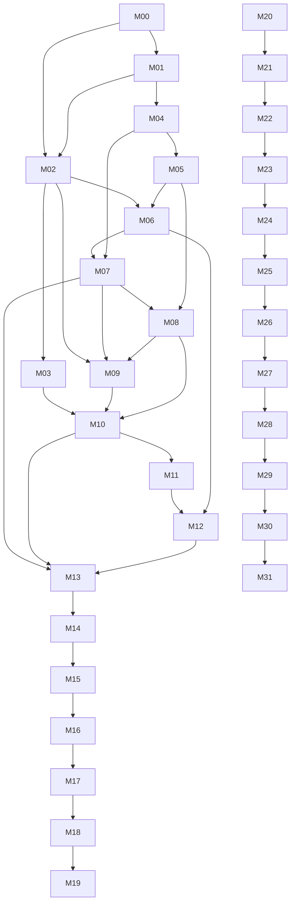

# SchemaBridge master plan

## Operating rule

Execute one milestone at a time, in order, unless this file explicitly permits parallel preparation. Each accepted milestone ends with a clean commit and a completed handoff. A later milestone may consume only interfaces and behavior already accepted.

## Critical path

| ID | Milestone | Timebox | Codex effort | Gate |
|---|---|---:|---|---|
| M00 | Repository baseline | 2 h | High | clean install and `make check` |
| M01 | Synthetic demo database | 3 h | High | resettable DB and ground-truth query |
| M02 | Domain and normalization | 4 h | Extra High | pure typed normalization core |
| M03 | Query IR/compiler/guard | 4 h | Extra High | safe compiled north-star SQL |
| M04 | Local DataHub | 4 h | Extra High | ingested assets and MCP read |
| M05 | DataHub read adapter | 3 h | Extra High | tested port/adapter context reads |
| M06 | Semantic candidate engine | 4 h | Extra High | explainable ranked mappings |
| M07 | Canonical review/write-back | 3 h | Extra High | approved Customer context in DataHub |
| M08 | Join discovery/contracts | 4 h | Extra High | approved fanout-aware joins |
| M09 | Guided query builder | 2 h | High | typed LLM-free request |
| M10 | Planner/execution | 4 h | Extra High | guided end-to-end result |
| M11 | Natural-language intent | 3 h | Extra High | typed Spanish request equivalence |
| M12 | Agent orchestration | 2 h | Extra High | observable pause/resume workflow |
| M13 | Context write-back/reuse | 2 h | Extra High | persisted recipe reused in new run |
| M14 | Streamlit UI | 4 h | High | judge-ready workflow |
| M15 | Evaluation harness | 3 h | High | reproducible metrics/evidence |
| M16 | End-to-end hardening | 4 h | Ultra | multi-agent release audit |
| M17 | Judge deployment | 3 h | Extra High | stable public test path |
| M18 | Submission package | 5 h | Extra High | complete Devpost release |
| M19 | Optional OSS contribution | 3 h | Extra High | outside critical path |

Critical path estimate M00–M18: **63 hours**.

## Productionization track

The operator explicitly expanded the goal from hackathon submission to a professional production
service. M20+ may proceed from the locally verified automated baseline while M17/M18 external
deployment, media, and reviewer evidence remains pending. This exception does not accept M18,
authorize a release claim, or relax any clean-commit gate.

| ID | Milestone | Primary gate |
|---|---|---|
| M20 | Production identity, RBAC, and workflow isolation | OIDC claims, closed roles, durable tenant ownership |
| M21 | Generic governed semantic registry | no north-star-only planning registry |
| M22 | Complete live DataHub context loop | plan entirely from read-back governed context |
| M23 | Durable control plane and schema migrations | versioned migrations, recovery, reconciliation |
| M24 | Authenticated API and background workers | bounded API contracts, queues, idempotency |
| M25 | Scale, indexing, and pagination | bounded scans and measured local regression budgets |
| M26 | Join drift and semantic change management | drift detection, reapproval, blast radius |
| M27 | Dynamic Query Studio | catalog-driven guided and natural-language surface |
| M28 | Compiler/connectors/cost controls | supported dialect matrix and explain budgets |
| M29 | Operations and supply-chain hardening | observability, backups, SBOM, pinned CI actions |
| M30 | Production evaluation and security verification | adversarial corpus and release thresholds |
| M31 | Pilot and general-availability readiness | operated pilot, runbooks, rollback, sign-off |

The productionization track is sequential unless a milestone explicitly permits read-only parallel
audit. M20 contracts become the identity boundary reused by later API and worker entrypoints.

### Dynamic tenant catalog requirement

Catalog cardinality is tenant data, never a code/configuration constant. One organization may
connect 10 physical tables while another exposes 5,434 or more. M25 implements cursor-based
discovery, bounded page sizes, indexes, full reconciliation plus genuine-source delta refresh, and
measured fixtures at both small and 5,434-table cardinalities without loading the whole inventory
into memory. Per-workspace capacity changes through an expected-version operator path with
immutable revisions; tags and glossary terms participate in bounded field search. The latest local
report passes with 75 and 41,028 fields, sparse 64-field nested/Unicode/type-drift cases, and
natural default-planner asset/field index use. The final quality, integration, acceptance,
evaluation, package, audit, desktop/mobile browser, genuine cursor-expiry, rate, offline-DataHub,
bounded metadata-search, protected-data, console, overflow, and clean 1,538-test coverage gates
pass; M25 is accepted locally at 81.98% coverage. M27 must build every field/table selector and
description-based match from that tenant-scoped paginated catalog; no recorded table list or
domain-specific UI branch may define what can be selected.

This inventory requirement does not relax query safety. Catalogs may contain thousands of assets
while one compiled request remains subject to its governed per-query table/join maximum, allowlist,
fanout checks, result limit, and timeout.

M26 and M27 are complete and accepted locally. M28 is in progress under
`plans/M28_COMPILER_CONNECTORS_COST_CONTROLS.md`: it binds each managed plan to one tenant
connection and immutable route, makes PostgreSQL dialect support explicit, resolves only opaque
connector secrets, and adds bounded read-only `EXPLAIN` cost controls. M29 through M31 remain
sequentially blocked on their accepted predecessor; neither local acceptance nor queue position is
a global production/release GO.

## Dependency graph

## Parallel work permitted

Only the following preparation can overlap without changing the milestone acceptance order:

- M03 can be implemented with fakes while M04 environment setup is being investigated.
- Judge-facing copy outlines and screenshot checklists may be drafted after M10, but final claims wait for M15–M18.
- Deployment-option research may begin after M14; the chosen deployment is not implemented before M16 release approval.

Do not allow parallel agents to edit overlapping modules. The main thread integrates all changes.

## Interface contracts between modules

| Producer | Consumer | Contract |
|---|---|---|
| M02 domain | all later milestones | immutable typed semantic values and transformation plans |
| M03 SQL adapter | M10 | `ResolvedQueryPlan → CompiledQuery → ValidationReport` |
| M05 catalog adapter | M06/M08/M13 | DataHub context port with real/fake/recorded implementations |
| M06 matcher | M07 | candidate mappings with signal breakdown, risks, and no approval |
| M07 governance | M08/M09/M10 | approved logical models/mapping versions |
| M08 relationships | M10 | approved join contracts/cardinality/fanout policy |
| M09 guided input | M10/M11 | validated `AnalyticalRequest` |
| M10 planner | M12/M14 | resolved plan, validation, execution result |
| M11 language adapter | M12/M14 | typed request plus ambiguities/alternatives |
| M12 workflow | M14 | observable states, checkpoints, and traces |
| M13 recipes | M14/M15 | versioned reusable context and artifacts |
| M20 identity/access | M21–M31 | authenticated principal, closed permissions, workspace ownership |
| M21 semantic registry | M22/M23/M27 | atomic scoped model/mapping/join snapshot with independent query limits |

## Release blockers

Any of these blocks advancement to deployment:

- raw LLM SQL can reach execution;
- source database accepts a write from the runtime identity;
- SQL guard accepts multiple/destructive statements or Cartesian joins;
- north-star result differs from ground truth without an explained fixture change;
- fanout is hidden or unmitigated;
- DataHub write occurs without explicit approval;
- approved context cannot be retrieved/reused;
- live/recorded/fake integration mode is mislabeled;
- repository contains secrets or employer information;
- README/video claim unimplemented behavior.

## Scope-cut order

When schedule is threatened, cut features in this order:

1. M19 optional contribution.
2. Non-north-star concepts and extra role/date variants.
3. Charts and visual embellishment.
4. Three-table example; retain the two-table north-star path.
5. Multi-turn language follow-ups.
6. Native logical-field linking when a version-compatible documented DataHub artifact fallback is required.

Never cut the release blockers’ corresponding controls.

## After each milestone

1. Operator runs the manual test.
2. Codex updates `tasks/PROJECT_STATE.md` and `tasks/DECISION_LOG.md`.
3. Operator reviews `git diff` and quality output.
4. Commit with the proposed message.
5. Send the handoff to the development guide before opening the next Codex thread.
