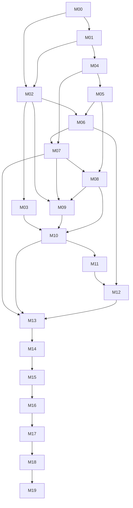

# SchemaBridge master plan

## Operating rule

Execute one milestone at a time, in order, unless this file explicitly permits parallel preparation. Each accepted milestone ends with a clean commit and a completed handoff. A later milestone may consume only interfaces and behavior already accepted.

## Critical path

| ID | Milestone | Timebox | Codex effort | Gate |
|---|---|---:|---|---|
| M00 | Repository baseline | 2 h | High | clean install and `make check` |
| M01 | Synthetic demo database | 3 h | High | resettable DB and ground-truth query |
| M02 | Domain and normalization | 4 h | Extra High | pure typed normalization core |
| M03 | Query IR/compiler/guard | 4 h | Extra High | safe compiled north-star SQL |
| M04 | Local DataHub | 4 h | Extra High | ingested assets and MCP read |
| M05 | DataHub read adapter | 3 h | Extra High | tested port/adapter context reads |
| M06 | Semantic candidate engine | 4 h | Extra High | explainable ranked mappings |
| M07 | Canonical review/write-back | 3 h | Extra High | approved Customer context in DataHub |
| M08 | Join discovery/contracts | 4 h | Extra High | approved fanout-aware joins |
| M09 | Guided query builder | 2 h | High | typed LLM-free request |
| M10 | Planner/execution | 4 h | Extra High | guided end-to-end result |
| M11 | Natural-language intent | 3 h | Extra High | typed Spanish request equivalence |
| M12 | Agent orchestration | 2 h | Extra High | observable pause/resume workflow |
| M13 | Context write-back/reuse | 2 h | Extra High | persisted recipe reused in new run |
| M14 | Streamlit UI | 4 h | High | judge-ready workflow |
| M15 | Evaluation harness | 3 h | High | reproducible metrics/evidence |
| M16 | End-to-end hardening | 4 h | Ultra | multi-agent release audit |
| M17 | Judge deployment | 3 h | Extra High | stable public test path |
| M18 | Submission package | 5 h | Extra High | complete Devpost release |
| M19 | Optional OSS contribution | 3 h | Extra High | outside critical path |

Critical path estimate M00–M18: **63 hours**.

## Dependency graph

## Parallel work permitted

Only the following preparation can overlap without changing the milestone acceptance order:

- M03 can be implemented with fakes while M04 environment setup is being investigated.
- Judge-facing copy outlines and screenshot checklists may be drafted after M10, but final claims wait for M15–M18.
- Deployment-option research may begin after M14; the chosen deployment is not implemented before M16 release approval.

Do not allow parallel agents to edit overlapping modules. The main thread integrates all changes.

## Interface contracts between modules

| Producer | Consumer | Contract |
|---|---|---|
| M02 domain | all later milestones | immutable typed semantic values and transformation plans |
| M03 SQL adapter | M10 | `ResolvedQueryPlan → CompiledQuery → ValidationReport` |
| M05 catalog adapter | M06/M08/M13 | DataHub context port with real/fake/recorded implementations |
| M06 matcher | M07 | candidate mappings with signal breakdown, risks, and no approval |
| M07 governance | M08/M09/M10 | approved logical models/mapping versions |
| M08 relationships | M10 | approved join contracts/cardinality/fanout policy |
| M09 guided input | M10/M11 | validated `AnalyticalRequest` |
| M10 planner | M12/M14 | resolved plan, validation, execution result |
| M11 language adapter | M12/M14 | typed request plus ambiguities/alternatives |
| M12 workflow | M14 | observable states, checkpoints, and traces |
| M13 recipes | M14/M15 | versioned reusable context and artifacts |

## Release blockers

Any of these blocks advancement to deployment:

- raw LLM SQL can reach execution;
- source database accepts a write from the runtime identity;
- SQL guard accepts multiple/destructive statements or Cartesian joins;
- north-star result differs from ground truth without an explained fixture change;
- fanout is hidden or unmitigated;
- DataHub write occurs without explicit approval;
- approved context cannot be retrieved/reused;
- live/recorded/fake integration mode is mislabeled;
- repository contains secrets or employer information;
- README/video claim unimplemented behavior.

## Scope-cut order

When schedule is threatened, cut features in this order:

1. M19 optional contribution.
2. Non-north-star concepts and extra role/date variants.
3. Charts and visual embellishment.
4. Three-table example; retain the two-table north-star path.
5. Multi-turn language follow-ups.
6. Native logical-field linking when a version-compatible documented DataHub artifact fallback is required.

Never cut the release blockers’ corresponding controls.

## After each milestone

1. Operator runs the manual test.
2. Codex updates `tasks/PROJECT_STATE.md` and `tasks/DECISION_LOG.md`.
3. Operator reviews `git diff` and quality output.
4. Commit with the proposed message.
5. Send the handoff to the development guide before opening the next Codex thread.
